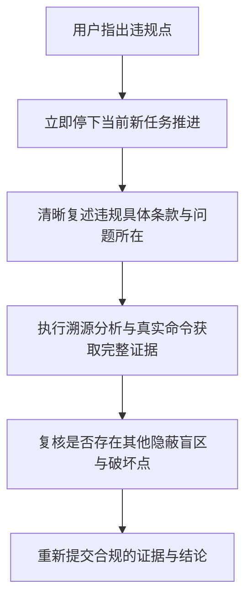

# 阶段交付自检清单与违规熔断机制 (Delivery Checklist & Fuse Mechanism)

在向用户提交阶段性成果或请求验收时，必须逐项对照本清单。只要有任意一项未满足，严禁提交验收。

---

## 1. 交付前 6 项强制自检清单 (Pre-delivery 6-Point Gate)

```markdown
- [ ] 1. 证据三要素齐全：每一个功能点都附带了真实的执行命令、原始完整输出与客观结论。
- [ ] 2. 编译报错根因已深挖：无草率强转、无 Dummy 参数垫补、无吞掉异常，全调用链契约一致（小编译错误 90% 潜藏大 Bug）。
- [ ] 3. 全链路打通：不仅单元测试通过，而且完成了从入口到持久化/响应的真实链路验证。
- [ ] 4. 平台与权限已实跑：Windows ACL、路径、文件锁等已在真实环境中读写验证，无自锁或权限溢出。
- [ ] 5. 数据库迁移无冲突：Flyway 版本号严格递增，无冲突，本地已成功执行迁移。
- [ ] 6. 诚实边界披露：无法在当前环境自动测试的部分已明确列为"待人工验证项"，未混淆视听。
```

---

## 2. 交付回复的标准模板 (Standard Handover Template)

在向用户提交成果时，建议使用如下结构：

```markdown
### 阶段成果交付说明

#### 一、已完成与已验证功能
1. **[功能名称 1]**
   - **验证命令**：`...`
   - **真实输出**：
     ```text
     ...
     ```
   - **验证结论**：...

2. **[功能名称 2]**
   - **验证命令**：`...`
   - **真实输出**：
     ```text
     ...
     ```
   - **验证结论**：...

#### 二、诚实边界披露 (待人工验证项)
- 【需人工验证 1】：因涉及前端物理点击/真机网络切换，当前环境无法自动化执行，请按以下步骤验证：...
- 【需人工验证 2】：...

#### 三、后续计划 / 待确认项
- ...
```

---

## 3. 违规熔断处理流程 (Violation & Recovery Protocol)

当用户指出违反协作规则（例如指出"违反了第 1 条"或"违反了第 2 条：敷衍解决编译报错"）时：


