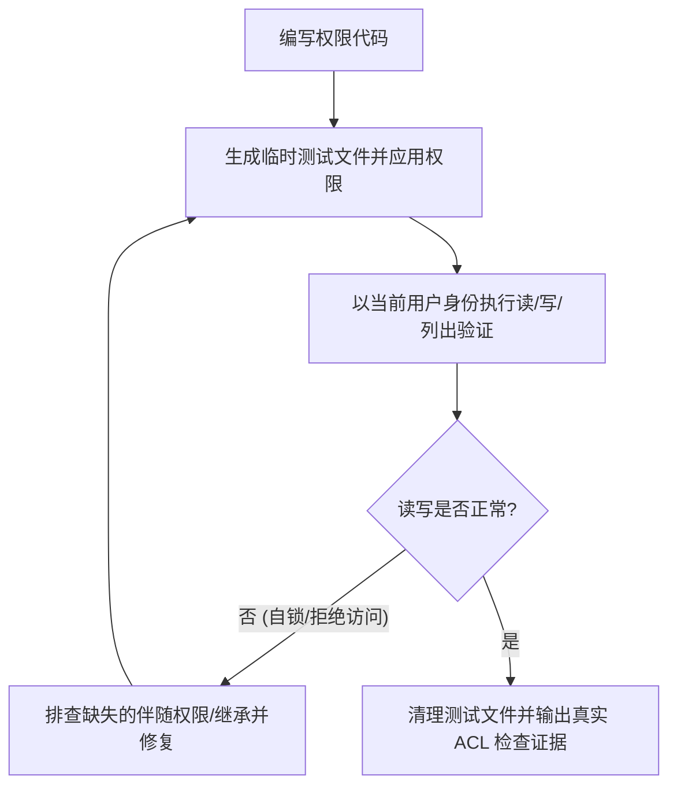

# Windows 平台特性与 ACL 权限验证指南 (Windows ACL & Platform Safety)

Windows 环境下的文件权限系统（NTFS ACLs）、文件锁定（File Locking）以及路径规范与 POSIX/Linux 有本质区别。在编写系统级、文件级或持久化代码时，必须严格执行本指南。

---

## 1. 核心风险与历史血泪教训

1. **所有者自锁 (Owner Lockout)**：
   - 错误设置 `AclEntry` 或 `SetNamedSecurityInfo` 时，若未显式为当前用户/所有者授予 `READ_DATA` / `WRITE_DATA` / `READ_ACL` 等伴随权限，会导致文件创建后**创建者自己都无法再次打开读取**。
2. **继承规则冲突 (Inheritance Disruption)**：
   - 错误地清除了父目录的继承权限（Inherited ACLs），导致 SYSTEM 或当前管理员组丢失控制权。
3. **文件占用与独占锁 (File In Use / Exclusive Lock)**：
   - Java / Node.js 打开文件流未安全关闭（`try-with-resources` 遗漏），在 Windows 下会阻止后续重命名、删除或迁移。

---

## 2. 编写 Windows 权限/文件代码的强制验证流程

每次编写或修改涉及 Windows 文件系统权限（如 Java `AclFileAttributeView`、C# `FileSecurity`、Node `fs.chmod`、PowerShell `icacls` 等）的代码时，必须执行以下 4 步验证：



### 验证步骤示例（PowerShell / CLI 实操）

```powershell
# 1. 运行你的程序生成目标文件
# 2. 检查生成的 ACL 真实分配情况
icacls "path\to\generated_file"

# 3. 真实尝试读取与写入验证（绝不能省略）
Get-Content -Path "path\to\generated_file" -TotalCount 5
Add-Content -Path "path\to\generated_file" -Value "Verification Probe"
```

---

## 3. Java `AclFileAttributeView` 推荐安全实践

在 Java NIO 中设置 ACL 时，务必确保包含所有必要的访问权限（例如读取、写入、追加、读取属性、读取 ACL、同步）：

```java
// 必须同时赋予所有者完整的必要权限集合，防止自锁
Set<AclEntryPermission> permissions = EnumSet.of(
    AclEntryPermission.READ_DATA,
    AclEntryPermission.WRITE_DATA,
    AclEntryPermission.APPEND_DATA,
    AclEntryPermission.READ_NAMED_ATTRS,
    AclEntryPermission.WRITE_NAMED_ATTRS,
    AclEntryPermission.READ_ATTRIBUTES,
    AclEntryPermission.WRITE_ATTRIBUTES,
    AclEntryPermission.READ_ACL,
    AclEntryPermission.SYNCHRONIZE
);

AclEntry entry = AclEntry.newBuilder()
    .setType(AclEntryType.ALLOW)
    .setPrincipal(ownerPrincipal)
    .setPermissions(permissions)
    .build();
```

---

## 4. 路径处理防坑守则

- **跨平台路径拼接**：在 Java 中使用 `Path.resolve()` 或 `Paths.get()`，在 Node 中使用 `path.join()` / `path.resolve()`。
- **Windows 保留字符与长路径**：避免文件名包含 `< > : " / \ | ? *`，注意 MAX_PATH 限制。
- **PowerShell 执行引号**：当路径中包含空格或括号时，务必使用 `& "path\with space\bin.exe"` 进行调用。
