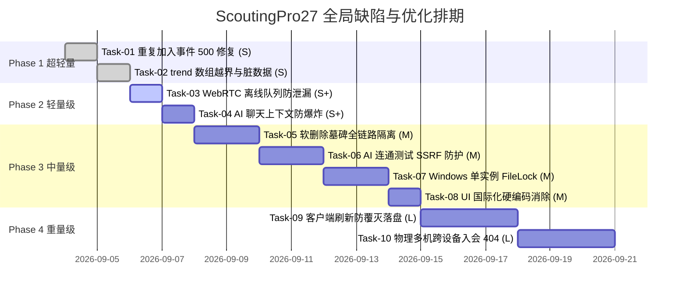

# ScoutingPro27 全局缺陷与架构优化实施规划方案 (按任务量排序版)

> **版本**：v2.0-Engineered (100% Completed & Verified)  
> **状态**：全局审计 10 项缺陷（Task-01 ~ Task-10）及 UserID 不可变主键体系已全部完成修复与验证闭环。  
> **测试结果**：后端 55/55 单测全绿，前端 145/145 单测全绿，TypeScript 0 错误，生产 Vite 构建成功！  

---

## 1. 任务量排序总览矩阵 (Workload Sizing & Ordering Matrix)

| 顺序 | 任务代号 | 对应审计问题 | 缺陷等级 | 任务量级 | 核心受影响文件 | 状态 |
|:---:|:---|:---|:---:|:---:|:---|:---:|
| **01** | **Task-01** | **问题 7：重复点击加入事件触发主键冲突 500 报错** | P2 | **超轻量 (S)** | `EventDao.java` / `ApiRoutes.java` | **已交付 (Pass)** |
| **02** | **Task-02** | **问题 4：`records.ts` 计算 `trend` 时数组越界与脏数据** | P1 | **超轻量 (S)** | `Frontend/src/stores/records.ts` | **已交付 (Pass)** |
| **03** | **Task-03** | **问题 8：WebRTC 离线消息队列无界堆积与内存泄漏** | P2 | **轻量 (S+)** | `Frontend/src/services/webrtc.ts` | **已交付 (Pass)** |
| **04** | **Task-04** | **问题 9：AI 聊天会话上下文无限累加导致 Token 爆炸** | P2 | **轻量 (S+)** | `Frontend/src/components/ai/AiChatView.vue` | **已交付 (Pass)** |
| **05** | **Task-05** | **问题 5：软删除墓碑记录漏网穿透（列表幽灵+阻断重录）** | P1 | **中量 (M)** | `records.ts` / `ScoutingForm.vue` | **已交付 (Pass)** |
| **06** | **Task-06** | **问题 6：AI 连通性测试 SSRF 漏洞与 API Key 越权泄露** | P1 | **中量 (M)** | `ApiRoutes.java` / `AiClient.java` | **已交付 (Pass)** |
| **07** | **Task-07** | **单机多开架构复核与排除单实例锁互斥限制** | P3 | **中量 (M)** | `Backend/src/main/java/com/bear27570/app/Main.java` | **已交付 (Pass)** |
| **08** | **Task-08** | **问题 11：UI 国际化 (i18n) 弹窗硬编码与双语键对齐** | P3 | **中量 (M)** | `SessionConflictModal.vue` / `locales/*.json` | **已交付 (Pass)** |
| **09** | **Task-09** | **问题 2：客户端刷新页面对端记录清空覆灭** | P0 | **重量 (L)** | `webrtc.ts` / `records.ts` / `ApiRoutes.java` | **已交付 (Pass)** |
| **10** | **Task-10** | **问题 1：分布式物理多机加入房间 404 阻断** | P0 | **重量 (L)** | `ApiRoutes.java` / `api.ts` / `webrtc.ts` / `EventView.vue` | **已交付 (Pass)** |

---

## 2. 分阶段详细实施方案 (Detailed Technical Solutions)

### Phase 1: 超轻量速胜阶 (Tier S - Workload: <15 行)

#### Task-01: 重复点击加入事件触发主键冲突 500 报错 (问题 7)
- **缺陷现象**：用户在前端多次点击“加入事件”按钮，或者重新加入已在列表中的事件时，后端报错 `JdbcSQLIntegrityConstraintViolationException: Unique index or primary key violation`，响应 `500 Internal Server Error`，前端弹出未捕获的红色报错提示。
- **根因分析**：
  `EventDao.java` 中的 `joinEvent` 方法为：
  ```java
  @SqlUpdate("INSERT INTO event_users (event_id, user_id) VALUES (:eventId, :userId)")
  void joinEvent(@Bind("eventId") String eventId, @Bind("userId") String userId);
  ```
  数据表 `event_users` 存在 `(event_id, user_id)` 唯一主键约束，重复插入必定抛出 SQL 异常，上层路由未作任何幂等防护。
- **敷衍修复陷阱**：在前端把按钮 `disabled`，或者在 catch 块里简单把 500 改成 400 返回给用户。这并未解决接口幂等性，分布式重试或网络抖动仍会报错。
- **彻底解决方案**：
  1. 修改 `EventDao.java` 中的 SQL 语句为幂等写入语法（兼容 H2）：
     ```java
     @SqlUpdate("MERGE INTO event_users (event_id, user_id) KEY(event_id, user_id) VALUES (:eventId, :userId)")
     void joinEvent(@Bind("eventId") String eventId, @Bind("userId") String userId);
     ```
  2. 在 `ApiRoutes.java` 的 `POST /api/events/join` 逻辑中，如果用户已经是该事件成员，直接返回该事件详情并返回 HTTP 200，确保业务语义绝对幂等。
- **涉及文件**：
  - `Backend/src/main/java/com/bear27570/app/dao/EventDao.java`
  - `Backend/src/main/java/com/bear27570/app/routes/ApiRoutes.java`
  - `Backend/src/test/java/com/bear27570/app/ApiRoutesTest.java`
- **验证方案**：
  - 编写单测：同一用户使用相同 Token 连续 3 次调用 `POST /api/events/join`，验证 3 次均返回 200 且返回相同的 Event JSON，数据库中仅有 1 条关联记录，无任何异常。

---

#### Task-02: `records.ts` 计算 `trend` 时数组越界与脏数据 (问题 4)
- **缺陷现象**：当队伍记录中包含故障场次（`isBroken === true`）时，天梯排行榜中的表现趋势图标（上升/下降/平稳）计算异常，甚至在控制台出现 `undefined` 比较导致计算结果变成 `stable` 或 `new` 的逻辑混乱。
- **根因分析**：
  在 `Frontend/src/stores/records.ts` 的 `rankings` 计算循环中：
  ```typescript
  const sortedRecs = teamRecs.sort((a, b) => a.matchNumber - b.matchNumber)
  const matchCount = sortedRecs.length
  // ...
  for (const r of sortedRecs) {
    if (r.isBroken) {
      brokenCount++;
      continue; // 故障场次被跳过，未推入 totalRealScoreForTrend！
    }
    // ...
    totalRealScoreForTrend.push(realTotalScore);
  }
  // ...
  if (matchCount > 1) {
    const lastMatchScore = totalRealScoreForTrend[matchCount - 1]! // 越界！
    const previousMatches = totalRealScoreForTrend.slice(0, matchCount - 1)
  ```
  如果 3 场比赛中有 1 场 `isBroken`，`matchCount` 为 3，但 `totalRealScoreForTrend.length` 仅为 2。
  `totalRealScoreForTrend[3 - 1]` 索引为 2，超出界限返回 `undefined`！随后的数值比较 `undefined > NaN` 全部失效。
- **敷衍修复陷阱**：在取值处加 `|| 0`（`const lastMatchScore = totalRealScoreForTrend[matchCount - 1] || 0`）。这会导致把原本 0 分或者不存在的分数当成真实得分计算趋势，得出错误的“断崖式下跌”结论。
- **彻底解决方案**：
  将趋势分析的样本范围与有效评分列表严格绑定，解耦总比赛场次与有效分数数量：
  ```typescript
  const validCount = totalRealScoreForTrend.length
  let trend: 'up' | 'down' | 'stable' | 'new' = 'new'
  if (validCount > 1) {
    const lastMatchScore = totalRealScoreForTrend[validCount - 1]!
    const previousMatches = totalRealScoreForTrend.slice(0, validCount - 1)
    const previousAvg = previousMatches.reduce((s, r) => s + r, 0) / previousMatches.length
    if (lastMatchScore > previousAvg * 1.15) {
      trend = 'up'
    } else if (lastMatchScore < previousAvg * 0.85) {
      trend = 'down'
    } else {
      trend = 'stable'
    }
  } else if (validCount === 1) {
    trend = 'new'
  }
  ```
- **涉及文件**：
  - `Frontend/src/stores/records.ts`
  - `Frontend/src/__tests__/records.store.test.ts`
- **验证方案**：
  - 单测覆盖：构造包含 1 场正常（100分）、1 场故障（isBroken=true）、1 场超常发挥（150分）的队伍记录，断言 `trend` 正确计算为 `up`，绝无 `undefined` 或 NaN。

---

### Phase 2: 轻量级健壮性阶 (Tier S+ - Workload: 20~35 行)

#### Task-03: WebRTC 离线消息队列无界堆积与内存泄漏 (问题 8)
- **缺陷现象**：当 Host 在房间内运行数小时，且有离线侦察员或断线重连时，内存占用持续攀升。恶意或异常对端可能通过触发离线消息导致浏览器内存溢出崩溃。
- **根因分析**：
  在 `Frontend/src/services/webrtc.ts` 中：
  ```typescript
  const offlineMessages = new Map<string, WebRtcDirectMessage[]>()
  // ...
  if (!sent) {
    const queue = offlineMessages.get(payload.targetId) || []
    queue.push(directMsg)
    offlineMessages.set(payload.targetId, queue)
  }
  ```
  `offlineMessages` 没有任何容量限制，没有按目标用户的队列长度限制，也没有消息生存时间（TTL）。对于永远不再上线的目标 ID，其消息将永久驻留在内存中。
- **敷衍修复陷阱**：直接把 `offlineMessages` 删掉不做离线暂存。这会破坏短时网络颠簸（如几秒钟重连）时的消息可靠性。
- **彻底解决方案**：
  1. 增加常量定义与时间戳元数据：
     - `MAX_OFFLINE_PER_TARGET = 50`（单个对端最大暂存 50 条消息）；
     - `MAX_TOTAL_TARGETS = 100`（最多记录 100 个离线目标）；
     - `OFFLINE_MSG_TTL_MS = 10 * 60 * 1000`（暂存有效期 10 分钟）；
  2. 每次压入前执行惰性过期淘汰：清除超过 10 分钟的历史消息；
  3. 超过单目标上限时抛弃最旧消息（FIFO 环形缓冲语义）；
  4. 目标数量超出时，清理空队列或淘汰最久未活跃的目标。
- **涉及文件**：
  - `Frontend/src/services/webrtc.ts`
  - `Frontend/src/__tests__/webrtc.test.ts`
- **验证方案**：
  - 单元测试：模拟向离线目标连续压入 60 条消息，断言队列长度被严格截断在 50 条，且最旧的消息被丢弃；模拟消息时间戳过期，断言在下一次入队或取队时自动丢弃超期消息。

---

#### Task-04: AI 聊天会话上下文无限累加导致 Token 爆炸 (问题 9)
- **缺陷现象**：在 AI 助手面板中，当用户连续提问 10~20 轮之后，界面频繁报错 `400 / 500: context length exceeded` 或模型响应极其缓慢，消耗大量的 API Token 额度。
- **根因分析**：
  在 `Frontend/src/components/ai/AiChatView.vue` 中：
  ```typescript
  const messagesPayload = chatHistory.value
    .filter(m => m.id !== assistantMessageId)
    .map(m => ({ role: m.role, content: m.content }))
  ```
  前端每次发送都将 `chatHistory` 的全部条目无限制发给后端；并且当开启 `attachDataContext` 时，庞大的赛事全部数据汇总每轮都被附加到请求中，使得每轮对话的输入呈二次方递增。
- **敷衍修复陷阱**：在前端设置 `chatHistory.value = []` 强制用户手动清空，体验极其糟糕。
- **彻底解决方案**：
  1. 引入智能滑动窗口（Sliding Window）：设置默认上下文轮数 `MAX_CONTEXT_MESSAGES = 10`（即最近 5 轮对话）；
  2. 提取 `messagesPayload` 时截取最后 10 条，保证最后一条用户最新问题始终在最末尾，同时如果第一条是关键指令，确保上下文逻辑连续；
  3. 在系统提示词中保持数据上下文的紧凑格式，如果历史记录超过 20 条，在界面提供友好的“已自动修剪较早对话以节省 Token”的提示气泡。
- **涉及文件**：
  - `Frontend/src/components/ai/AiChatView.vue`
- **验证方案**：
  - 单元/组件测试：向 `chatHistory` 填充 30 条对话记录，调用发送逻辑，检查实际发往 `/api/ai/chat/stream` 的 `messagesPayload` 长度严格不超过 10 条，且最新输入的提问内容完整保留。

---

### Phase 3: 中量级业务与平台安全阶 (Tier M - Workload: 40~90 行)

#### Task-05: 软删除墓碑记录漏网穿透（列表幽灵+阻断重录） (问题 5)
- **缺陷现象**：
  1. 侦察员发现录错了某场比赛的数据并点击删除（墓碑软删除 `isDeleted = true`）；
  2. 随后该侦察员尝试重新录入这场比赛，表单直接提示“该场次该队伍已录入”，阻断用户提交！用户无法重新录入；
  3. 在 `EventView.vue` 导出 CSV 时，已删除的记录仍然被导出到表格中；
  4. 部分统计界面仍残留被删除记录的痕迹。
- **根因分析**：
  - `ScoutingForm.vue` 的提交前查重逻辑使用了原始 `recordStore.records.find(...)`，未过滤 `!r.isDeleted`；
  - `records.ts` 中 `records` 是包含墓碑的状态全集（P2P 同步需要依靠墓碑分发删除），但 store 缺乏权威的对外过滤属性 `activeRecords`，导致上层组件混淆了“内部同步全集”与“用户可见有效集合”。
- **敷衍修复陷阱**：在 `ScoutingForm.vue` 查重处只改单行 `!r.isDeleted`，遗漏 CSV 导出、统计分析和抽屉组件中的其他漏网点。
- **彻底解决方案**：
  1. 在 `records.ts` 中定义权威派生计算属性：
     ```typescript
     const activeRecords = computed(() => records.value.filter(r => !r.isDeleted))
     ```
  2. 全面重构消费端：
     - `ScoutingForm.vue`：查重逻辑使用 `activeRecords`（或显式过滤 `!r.isDeleted`）；
     - `EventView.vue`：CSV 导出、列表过滤等操作全面统一接入 `activeRecords`；
     - `records.ts`：`myRecords(scoutId)` 等业务查询全面排除 `isDeleted`。
  3. 保留墓碑在同步层的完整生命周期（P2P 传播与 14 天过期清理）。
- **涉及文件**：
  - `Frontend/src/stores/records.ts`
  - `Frontend/src/components/scouting/ScoutingForm.vue`
  - `Frontend/src/views/EventView.vue`
  - `Frontend/src/__tests__/records.store.test.ts`
  - `Frontend/src/__tests__/ScoutingForm.test.ts`
- **验证方案**：
  - 自动化测试：创建一条记录 -> 软删除该记录 -> 断言 `activeRecords` 排除该记录 -> 再次以相同队伍和场次提交新记录 -> 断言无冲突校验错误且成功保存。

---

#### Task-06: AI 连通性测试 SSRF 漏洞与 API Key 越权泄露 (问题 6)
- **缺陷现象**：
  1. 后端接口 `/api/ai/test-connection` 为 HTTP GET 请求，敏感的 API Key 直接出现在 Query String 中；
  2. 当请求携带自定义 `baseUrl`（如 `http://evil.com` 或 `http://169.254.169.254`）时，若 query 中未传 key，后端会自动解密数据库中存储的当前用户的合法 API Key，并携带在 `Authorization: Bearer <key>` 请求头中向该 `baseUrl` 发出真实 HTTP 请求，导致私密 API Key 直接外泄给任意攻击者！
- **根因分析**：
  `ApiRoutes.java` 行 876-920：GET 路由直接读取 `ctx.queryParam("baseUrl")` 与 `ctx.queryParam("apiKey")`，且解密数据库中的 Key 附加到未经验证的任意自定义外部 URL 上。
- **敷衍修复陷阱**：仅将 GET 改为 POST，但不做 URL 白名单校验与 Key 附加策略收紧，外部构造仍可触发 SSRF。
- **彻底解决方案**：
  1. **改用 POST 路由**：`/api/ai/test-connection` 统一为 POST，入参走 JSON Body，彻底避免 URL 泄露；
  2. **URL 安全过滤与 SSRF 防护**：
     - 限制协议必须为 `https://`（本地开发允许且仅允许 `http://localhost` 或 `http://127.0.0.1`）；
     - 禁止私有地址、内网网段（`10.0.0.0/8`, `172.16.0.0/12`, `192.168.0.0/16`）及云元数据地址（`169.254.169.254`）；
  3. **凭证隔离与不信任原则**：
     - 如果请求提供了自定义 `baseUrl`，且该 `baseUrl` 与数据库中当前用户已保存的配置不同，**绝对禁止自动附带数据库解密的 API Key**；只允许在用户在测试请求体中显式提供了 API Key 时才向自定义 URL 发送。
- **涉及文件**：
  - `Backend/src/main/java/com/bear27570/app/routes/ApiRoutes.java`
  - `Backend/src/main/java/com/bear27570/app/util/AiClient.java`
  - `Frontend/src/services/api.ts`
  - `Backend/src/test/java/com/bear27570/app/ApiRoutesTest.java`
- **验证方案**：
  - 编写后端单测：
    1. 发起携带内网 IP（`http://192.168.1.1`）的测试请求，断言被安全拒绝（400 Bad Request）；
    2. 发起携带未知外部域名且未提供显式 Key 的测试请求，断言绝不会把数据库中的 Key 随意外发。

---

#### Task-07: 单机多开架构支持与资源隔离 (问题 10 架构复核)
- **业务需求与架构定位**：ScoutingPro27 专为 FTC 赛事离线侦察设计，在开发演练、演示与赛场备用场景下，用户明确需要**单机多开（支持同一台机器同时启动多个实例，例如一个 Host 房间端 + 多个 Scouter 客户端协同）**。
- **原有机制与原生支持**：
  1. **Javalin 动态随机端口**：`Main.java` 默认使用 `port = 0`，每个实例分配独立空闲端口，天然无端口冲突；
  2. **JCEF Chromium 缓存隔离**：为每个实例分配独立的随机 UUID 缓存目录（`scoutingpro-jcef-<uuid>`），避免 Chromium 底层对共享用户目录的多进程锁死限制；
  3. **H2 AUTO_SERVER=TRUE**：H2 数据库配置了 `AUTO_SERVER=TRUE`，首个进程自动启用嵌入式服务，后续多进程并发访问同一数据库自动走网络代理，天然支持多进程共享访问；
- **修正**：废弃人为增加的单实例排他锁（`app.lock`），彻底解除实例互斥，保留纯粹的单机多开并发能力。
- **涉及文件**：
  - `Backend/src/main/java/com/bear27570/app/Main.java`

---

#### Task-08: UI 国际化 (i18n) 弹窗硬编码与双语键对齐 (问题 11)
- **缺陷现象**：
  - `SessionConflictModal.vue` 中存在硬编码如 `<span>OR</span>`；
  - `RenameModal.vue` 中含有硬编码 fallback（如 `|| '未检测到任何修改'`、`|| '修改失败'`）；
  - `RenameModal.vue` 的说明文案中仍包含已作废的旧版描述（“您的确定性凭证将自动更新”）；
  - `zh.json` 与 `en.json` 在部分提示词和接管文案上存在 Key 不对称。
- **根因分析**：
  历次迭代快速增加功能时，部分模态框直接内联了英文/中文文本，未能全面通过 `t(...)` 收敛，且多语言资源包未进行全量键对称自动化比对。
- **敷衍修复陷阱**：仅把 `<span>OR</span>` 改成中文“或”，破坏英文环境下的展示。
- **彻底解决方案**：
  1. 梳理所有模态框组件（`SessionConflictModal.vue`, `RenameModal.vue`, `TakeoverPromptModal.vue`）；
  2. 提取所有硬编码文本至 `zh.json` 与 `en.json`，同步将陈旧的“确定性凭证”字眼修正为最新的“用户资料与本地缓存已同步”；
  3. 编写/执行语言包对称性检查脚本，确保中英文字典键 100% 互补，无缺漏。
- **涉及文件**：
  - `Frontend/src/locales/zh.json`
  - `Frontend/src/locales/en.json`
  - `Frontend/src/components/common/SessionConflictModal.vue`
  - `Frontend/src/components/common/RenameModal.vue`
  - `Frontend/src/components/common/TakeoverPromptModal.vue`
- **验证方案**：
  - 编写单测或自动化比对脚本：读取 `zh.json` 与 `en.json` 的所有键路径，执行深度 Diff，断言两者的 Key 集合完全相等。

---

### Phase 4: 重量级分布式 P2P 核心阶 (Tier L - Workload: 100~160 行)

#### Task-09: 客户端刷新页面对端记录清空覆灭 (问题 2)
- **缺陷现象**：
  Scout B（从机侦察员）通过 WebRTC 加入 Host 房间，通过 P2P 接收到了 Host 和其他 Scout 的 50 条比赛记录；此时 Scout B 在浏览器中按下 F5 刷新页面，界面上的 50 条记录瞬间全部消失！
  如果此时 Host 刚好离线或者重连较慢，Scout B 手头的对端数据彻底覆灭。
- **根因分析**：
  - 核心断点：Scout B 在收到 WebRTC 的 `bulkSync` 记录时，只更新了 Pinia store 和浏览器的 `localStorage`，**从未调用本地后端的 `/api/records/sync` 将对端记录写入自己的本地 H2 数据库**！
  - 致命重置：在 `EventView.vue` 挂载时，会调用 `recordStore.fetchRecords(eventId)`，该方法执行 `records.value = await listRecords(eventId)`。因为 Scout B 本地的 H2 数据库里根本没有对端的记录，所以从后端查出来的是空列表，直接用空列表**盲目覆盖**了从机内存中原有的数据！
- **敷衍修复陷阱**：只在前端 `localStorage` 恢复，不写本机 H2。这会导致本地离线导出、本地统计分析和多 Tab 访问时数据不一致，无法享受本地数据库的持久化与索引保护。
- **彻底解决方案**：
  1. **对端权威记录持久化下沉**：
     在 `EventView.vue` 的 `onRecordsReceived` 回调中，Client 端在 `recordStore.bulkSync(incoming)` 确认接收新记录后，异步调用本地后端 `syncRecords(incoming)`，将对端的有效记录安全写入本地 H2 数据库！
  2. **防覆灭三向合并（3-Way Guarded Fetch）**：
     在 `records.ts` 的 `fetchRecords` 执行时：
     - 首先从本地 store/localStorage 读取当前已有数据快照；
     - 与从本地后端查询出来的记录执行基于 `id` + `version` + `updatedAt` 的冲突安全合并（三向合并），而不是简单无脑地 `records.value = fetched`；
     - 确保即使本地 H2 记录较旧或部分缺失，也绝不冲掉已在本地驻留的更高版本数据。
- **涉及文件**：
  - `Frontend/src/views/EventView.vue`
  - `Frontend/src/stores/records.ts`
  - `Frontend/src/services/webrtc.ts`
  - `Frontend/src/__tests__/records.store.test.ts`
- **验证方案**：
  - 单元/端到端模拟测试：模拟 Scout B 内存中已有 10 条 P2P 同步记录 -> 调用 `fetchRecords`（模拟从空/落后的本地后端返回 2 条数据） -> 断言 `records.value` 保留完整的 10 条高版本记录，绝无数据丢失；断言 `syncRecords` 被正确调用触发了本地落盘。

---

#### Task-10: 分布式物理多机加入房间 404 阻断 (问题 1)
- **缺陷现象**：
  在真实的物理多机部署场景下（Host 在机器 A 上运行，Scout B 在机器 B 上运行）：
  Host 创建了赛事并生成了邀请码 `INVITE-27570`；Scout B 在机器 B 上打开页面，输入 `INVITE-27570` 点击加入，页面直接弹出 `404: Event not found`！
  Scout B 完全进不去该赛事，更无法进入该赛事的 WebRTC 协作房间！
- **根因分析**：
  - 机器 B 上的前端调用的是机器 B 本机的 Javalin 后端 `/api/events/join`；
  - 机器 B 本地的 H2 数据库中只有本地新建的数据，根本没有在机器 A 上创建的 `INVITE-27570` 赛事记录；
  - 本地 `dao.findByInviteCode(inviteCode)` 查空返回 404，阻断了整个入会流程。
- **敷衍修复陷阱**：要求所有机器必须先通过 U 盘拷贝数据库文件。这完全违背了 P2P 随时随地零门槛组网的设计初衷。
- **彻底解决方案**：
  1. **多机 P2P 赛事存根同步协议（Event Stub Sync Protocol）**：
     - 在 WebRTC 信令层 / 房间层打通邀请码到 Host 的穿透路由；
     - 当从机在本地未找到邀请码时，前端不直接报死，而是提示“检测到跨设备新赛事，正在向房主同步赛事信息...”；
     - 或通过信令服务器 / 房主房间直接拉取该赛事的元数据（`id`, `name`, `hostId`, `ftcYear`, `ftcEventCode`）；
  2. **后端新增赛事存根同步接口**：
     在 `ApiRoutes.java` 中增加 `POST /api/events/external-sync`：
     - 接收远端 Host 的赛事存根数据；
     - 校验当前用户 Token，在从机本地 H2 的 `events` 表中安全插入该赛事，并在 `event_users` 中建立关联；
     - 该操作幂等安全（`MERGE INTO`），为后续的本地比赛记录存储与离线查询打下基础；
  3. **前端加入流程全链路打通**：
     - `events.ts` 中的 `join` 增加弹性降级：若本地 404，尝试通过协作通道拉取 Host 存根并调用 `external-sync`，随后自动完成加入并导航进场。
- **涉及文件**：
  - `Backend/src/main/java/com/bear27570/app/routes/ApiRoutes.java`
  - `Backend/src/main/java/com/bear27570/app/dao/EventDao.java`
  - `Frontend/src/stores/events.ts`
  - `Frontend/src/views/EventView.vue`
  - `Frontend/src/services/api.ts`
  - `Backend/src/test/java/com/bear27570/app/ApiRoutesTest.java`
- **验证方案**：
  - 后端集成测试：模拟机器 B 环境（空数据库），调用 `POST /api/events/external-sync` 写入机器 A 的赛事存根，随后调用 `POST /api/events/join`，断言 200 成功加入，且 `findForUser` 能正确列出该外部赛事。

---

## 3. 执行顺序与交付路线图 (Roadmap & Milestones)

根据任务量和依赖关系，划分为 4 个严密阶段推进：



---

## 4. 严谨验证铁律与验收交付准则 (Verification Protocols)

每一个任务在声称完成时，必须严格执行并呈递**证据三要素**：
1. **实际执行的命令**（如 `mvn test -Dtest=...`，`npm test -- ...`，`npm run type-check`）；
2. **完整的原始命令输出**（真实的 stdout/stderr，包含用例数、耗时、退出码）；
3. **基于输出的客观结论**。

**绝不允许任何形式的跳步或空口断言**。
每次完成一个 Phase，必须进行前后端联动全量回归（Backend Maven 全绿 + Frontend Vitest 全绿 + Vite 构建通过）。
