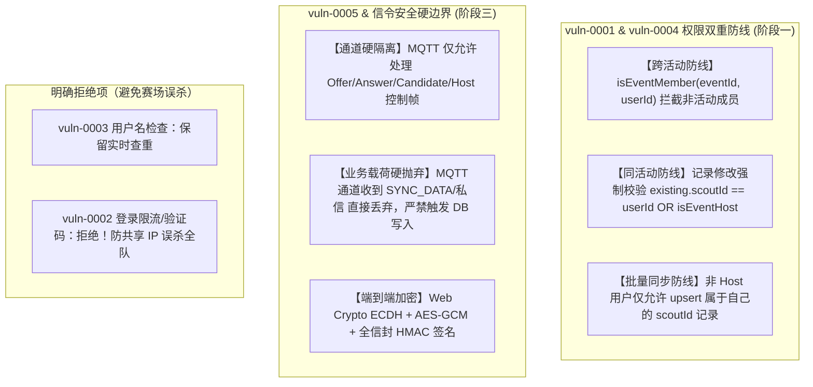
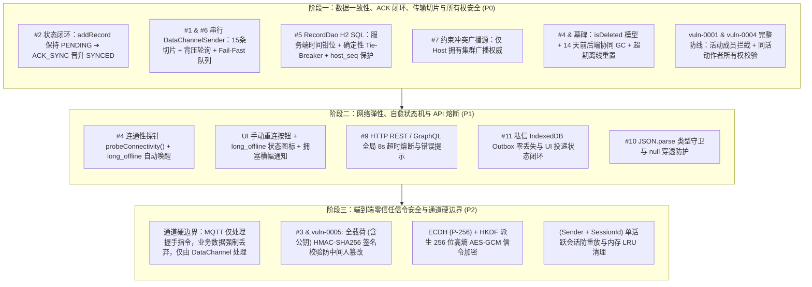

# ScoutingPro27 网络同步与数据安全深度重构方案 (V2.4 生产就绪执行总案)

> **版本**：v2.4 (Complete Defense & Production Execution Ready)  
> **状态**：待执行  
> **更新时间**：2026-08-14  
> **核心原则**：数据零丢失 (Zero Data Loss)、传输防击穿 (Backpressure/Chunking)、链路自愈 (Self-Healing)、信令端到端防嗅探 (E2E Encrypted Signaling)、通道能力硬边界 (Hard Channel Boundary)、同活动数据所有权防篡改 (Intra-Event IDOR Protection)、边界诚实披露 (Explicit Disclosure)。

---

## 目录
1. [架构现状与核心痛点回顾](#1-架构现状与核心痛点回顾)
2. [安全审计与专项处置决策 (8月8日渗透报告完整闭环)](#2-安全审计与专项处置决策-8月8日渗透报告完整闭环)
   - [2.1 vuln-0001 完整防线：活动成员隔离 + 同活动作者所有权校验](#21-vuln-0001-完整防线活动成员隔离--同活动作者所有权校验)
   - [2.2 vuln-0004：GET /api/records 活动成员越权拦截](#22-vuln-0004get-apirecords-活动成员越权拦截)
   - [2.3 vuln-0005 & 信令层硬边界：通道副作用物理隔离 + 客户端端到端加密](#23-vuln-0005--信令层硬边界通道副作用物理隔离--客户端端到端加密)
   - [2.4 明确拒绝项 (拒绝无意义复杂度与赛场隐患)](#24-明确拒绝项-拒绝无意义复杂度与赛场隐患)
3. [核心技术缺陷与深度纠偏设计](#3-核心技术缺陷与深度纠偏设计)
   - [3.1 H2 MERGE 确定性 Tie-Breaker 与 host_seq 保护 (含服务端时间钳位)](#31-h2-merge-确定性-tie-breaker-与-host_seq-保护-含服务端时间钳位)
   - [3.2 墓碑机制 (Tombstone)、前后端 GC 与超期离线防复活](#32-墓碑机制-tombstone前后端-gc-与超期离线防复活)
   - [3.3 传输切片与 DataChannelSender (队列防中毒 + 拥塞快速熔断 Fail-Fast)](#33-传输切片与-datachannelsender-队列防中毒--拥塞快速熔断-fail-fast)
   - [3.4 真实连通性探测 (Probe) 与自愈状态机](#34-真实连通性探测-probe-与自愈状态机)
   - [3.5 私信零丢失策略 (Outbox + 显式状态反馈)](#35-私信零丢失策略-outbox--显式状态反馈)
   - [3.6 ECDH 临时密钥协商 + 全载荷 HMAC + 会话 LRU 清理防重放](#36-ecdh-临时密钥协商--全载荷-hmac--会话-lru-清理防重放)
4. [重构实施阶段规划 (Phased Roadmap)](#4-重构实施阶段规划-phased-roadmap)
   - [阶段一：数据一致性、ACK 闭环、传输切片与所有权安全 (P0)](#阶段一数据一致性ack-闭环传输切片与所有权安全-p0)
   - [阶段二：网络弹性、自愈状态机与 API 熔断 (P1)](#阶段二网络弹性自愈状态机与-api-熔断-p1)
   - [阶段三：端到端零信任信令安全与通道硬边界 (P2)](#阶段三端到端零信任信令安全与通道硬边界-p2)
5. [诚实边界披露与已知局限性 (Explicit Disclosure)](#5-诚实边界披露与已知局限性-explicit-disclosure)
6. [验证与验收标准 (Evidence-Based Verification)](#6-验证与验收标准-evidence-based-verification)

---

## 1. 架构现状与核心痛点回顾

ScoutingPro27 采用 **Host 权威中心拓扑 (Host-Centric Star Topology)**：
- **信令层**：通过公网公共 MQTT Broker (`broker.emqx.io`) 进行 SDP / ICE 握手；
- **传输层**：基于 WebRTC DataChannel (SCTP) 进行局域网/跨网点对点数据传输；
- **存储层**：前端 Pinia + IndexedDB/LocalStorage，后端 Java + Javalin + JDBI + H2 Database。

---

## 2. 安全审计与专项处置决策 (8月8日渗透报告完整闭环)



### 2.1 vuln-0001 完整防线：活动成员隔离 + 同活动作者所有权校验

#### 攻击向量拆解
1. **向量 A（跨活动越权）**：非本活动成员向目标 `eventId` 提交记录 ➔ **通过 `EventDao.isMember` 彻底阻断**；
2. **向量 B（同活动内恶意/意外覆盖队友记录）**：同活动合法成员拿到队友某条记录的 UUID，提交更高版本覆盖原记录 ➔ **通过记录所有权校验彻底阻断**。

#### 离线优先与所有权保护兼顾设计
由于离线场景下必须允许前端离线生成 UUID，不能简单剥夺客户端 UUID 生成权。后端在 `POST /api/records` 与 `POST /api/records/sync` 实施以下严格鉴权：

1. **单条记录写入 (`POST /api/records`)**：
   - 校验 `isEventMember(record.getEventId(), userId)`，未加入活动返回 `403 Forbidden`；
   - 检查记录 ID 是否已存在于数据库：
     - **新记录**：强制注入 `record.setScoutId(userId)`，允许插入；
     - **已有记录**：查询已有记录归属 `existing = recordDao.findById(record.getId())`；
       - 若 `existing.getScoutId().equals(userId) || isEventHost(record.getEventId(), userId)`：允许更新（作者本人或主持人拥有修改权限）；
       - 否则：**立即拒绝并响应 `403 Forbidden: Cannot modify another scout's record`**。
2. **批量同步接口 (`POST /api/records/sync`)**：
   - 若发起者是 **Host 主持人** (`isEventHost`)：允许同步该活动下所有队员汇总的数据；
   - 若发起者是 **普通 Scout 队员**：仅允许同步 `record.getScoutId().equals(userId)` 的本人记录，若包含他人记录则拒绝写入。

---

### 2.2 vuln-0004：GET /api/records 活动成员越权拦截
- **处置**：在 `ApiRoutes.java` 中执行 `isEventMember(eventId, userId)` 校验，非活动成员访问直接返回 `403 Forbidden`。

---

### 2.3 vuln-0005 & 信令层硬边界：通道副作用物理隔离 + 客户端端到端加密

#### 1. 通道能力与副作用物理隔离 (Hard Channel Boundary)
在客户端 `webrtc.ts` 中**显式写死通道职能边界**，拒绝任何“格式不匹配自然忽略”的隐式假设：
- **MQTT 信令通道白名单**：
  ```ts
  const SIGNALING_ALLOWED_TYPES = new Set([
    'offer', 'answer', 'candidate', 'host_hello', 'HOST_LEAVING'
  ])
  ```
- **硬隔离防护规则**：
  1. MQTT 接收端先验 HMAC 签名与消息类型；
  2. 若收到任何业务类指令（如 `SYNC_DATA`, `DIRECT_MESSAGE`, `REQUEST_SYNC`, `ACK_SYNC`），**立即判定为非法越权报文并强制丢弃**，控制台记录安全告警：
     ```ts
     console.warn(`[Security] Dropped illegal business payload '${msg.type}' over public MQTT signaling channel.`)
     ```
  3. **所有业务数据写入、状态流转与本地数据库持久化，只能且必须通过经过握手鉴权的 `RTCDataChannel.onmessage` 触发**。

#### 2. 客户端端到端高熵加密 (Web Crypto API)
- 废弃自建 MQTT 网关的重度方案；
- 采用 **ECDH (P-256) 协商 256 位会话密钥 + AES-GCM 加密 + HMAC-SHA256(inviteCode) 全载荷签名**，公网 MQTT Broker 仅作为无感知加密中继。

---

### 2.4 明确拒绝项 (拒绝无意义复杂度与赛场隐患)
- **`vuln-0003` (用户名枚举 - 拒绝)**：保留注册框实时防重名体验。
- **`vuln-0002` (登录防爆破限流/验证码 - 拒绝)**：防止赛场移动热点同 IP 误杀全队，依靠现有 **BCrypt (~100ms CPU 单次计算)** 提供物理算力防御。

---

## 3. 核心技术缺陷与深度纠偏设计

### 3.1 H2 MERGE 确定性 Tie-Breaker 与 host_seq 保护 (含服务端时间钳位)

#### 规则设计
1. **版本号绝对优先**：业务编辑以 `version` 递增为主判据；
2. **服务端时间钳位 (Time Clamping)**：落库校验 `src.updated_at`，若超过服务器当前时间 5 秒（`src.updated_at > CURRENT_TIMESTAMP + 5s`），钳位为服务器时间；
3. **确定性兜底**：同版本且时间戳相等时，按 `src.scout_id >= target.scout_id` 字典序判定；
4. **`host_seq` 单调性保护**：保留 `GREATEST(COALESCE(target.host_seq, 0), src.host_seq)`。

```sql
-- RecordDao.java
MERGE INTO scouting_records AS target
USING (VALUES (
    :id, :eventId, :scoutId, :scoutName,
    :matchNumber, :teamNumber,
    :autoScore, :teleopScore, :endgameScore, :totalScore,
    :notes, :rawData, :syncStatus, :isBroken, :isDeleted,
    COALESCE(:createdAt, CURRENT_TIMESTAMP),
    CASE 
        WHEN :updatedAt > DATEADD('SECOND', 5, CURRENT_TIMESTAMP) THEN CURRENT_TIMESTAMP
        ELSE COALESCE(:updatedAt, CURRENT_TIMESTAMP)
    END,
    :version, :hostSeq
)) AS src (
    id, event_id, scout_id, scout_name,
    match_number, team_number,
    auto_score, teleop_score, endgame_score, total_score,
    notes, raw_data, sync_status, is_broken, is_deleted,
    created_at, updated_at,
    version, host_seq
)
ON target.id = src.id
WHEN MATCHED AND (
    src.version > COALESCE(target.version, 0)
    OR (
        src.version = COALESCE(target.version, 0) 
        AND (
            src.updated_at > COALESCE(target.updated_at, '1970-01-01 00:00:00')
            OR (
                src.updated_at = COALESCE(target.updated_at, '1970-01-01 00:00:00')
                AND src.scout_id >= COALESCE(target.scout_id, '')
            )
        )
    )
) THEN
  UPDATE SET
    event_id      = src.event_id,
    scout_id      = src.scout_id,
    scout_name    = src.scout_name,
    match_number  = src.match_number,
    team_number   = src.team_number,
    auto_score    = src.auto_score,
    teleop_score  = src.teleop_score,
    endgame_score = src.endgame_score,
    total_score   = src.total_score,
    notes         = src.notes,
    raw_data      = src.raw_data,
    sync_status   = src.sync_status,
    is_broken     = src.is_broken,
    is_deleted    = src.is_deleted,
    updated_at    = src.updated_at,
    version       = src.version,
    host_seq      = CASE
        WHEN src.host_seq IS NULL THEN target.host_seq
        ELSE GREATEST(COALESCE(target.host_seq, 0), src.host_seq)
    END
WHEN NOT MATCHED THEN
  INSERT (
    id, event_id, scout_id, scout_name,
    match_number, team_number,
    auto_score, teleop_score, endgame_score, total_score,
    notes, raw_data, sync_status, is_broken, is_deleted,
    created_at, updated_at,
    version, host_seq
  ) VALUES (
    src.id, src.event_id, src.scout_id, src.scout_name,
    src.match_number, src.team_number,
    src.auto_score, src.teleop_score, src.endgame_score, src.total_score,
    src.notes, src.raw_data, src.sync_status, src.is_broken, src.is_deleted,
    src.created_at, src.updated_at,
    src.version, src.host_seq
  )
```

---

### 3.2 墓碑机制 (Tombstone)、前后端 GC 与超期离线防复活
1. **前后端对齐 GC**：统一 14 天 TTL，前端定期清理过期墓碑，后端执行 `DELETE WHERE is_deleted = TRUE AND updated_at < NOW() - 14 DAYS`；
2. **超期离线自愈**：客户端检测 `lastSyncTime > 14 天` 时，主动触发 **Full Clean Sync**，备份未推数据后清空本地已同步缓存，重新拉取最新基线，防止已被服务端 Purge 的已删除记录在端侧复活。

---

### 3.3 传输切片与 DataChannelSender (队列防中毒 + 拥塞快速熔断 Fail-Fast)
1. **显式任务队列 (FIFO Task Queue)**：任务独立 resolve/reject，彻底消除 Promise 链中毒失效；
2. **实例 1:1 物理隔离**：Host 端按 Client 独立实例化 `DataChannelSender`，互不阻塞；
3. **递归轮询背压检测**：`setInterval(100ms)` 轮询 + `bufferedamountlow` 双重监听；
4. **拥塞快速熔断 (Fail-Fast)**：任务触发 5000ms 背压超时后，立即 Fail-Fast 释放队列中所有剩余排队任务，避免数分钟持续阻塞，向 UI 触发“网络传输缓慢”反馈。

```ts
// frontend/src/services/dataChannelSender.ts
export class DataChannelSender {
  private queue: Array<{
    payload: string
    resolve: () => void
    reject: (err: any) => void
  }> = []
  private isProcessing = false

  private readonly BUFFER_HIGH_WATERMARK = 64 * 1024 // 64 KiB
  private readonly BUFFER_LOW_WATERMARK  = 32 * 1024 // 32 KiB
  private readonly MAX_BACKPRESSURE_TIMEOUT = 5000   // 5s 超时熔断

  constructor(
    private dc: RTCDataChannel,
    private onCongestion?: (isCongested: boolean) => void
  ) {}

  public enqueueSend(payload: string): Promise<void> {
    return new Promise<void>((resolve, reject) => {
      this.queue.push({ payload, resolve, reject })
      this.processQueue()
    })
  }

  private async processQueue(): Promise<void> {
    if (this.isProcessing) return
    this.isProcessing = true

    while (this.queue.length > 0) {
      const task = this.queue.shift()
      if (!task) break

      try {
        await this.safeSendInternal(task.payload)
        task.resolve()
        this.onCongestion?.(false)
      } catch (err) {
        console.error('[DataChannelSender] Send task failed:', err)
        task.reject(err)

        if (err instanceof BackpressureTimeoutError) {
          this.onCongestion?.(true)
          this.failFastRemaining(new Error('Queue aborted due to network congestion'))
          break
        }
      }
    }

    this.isProcessing = false
  }

  private failFastRemaining(error: Error) {
    while (this.queue.length > 0) {
      const remaining = this.queue.shift()
      remaining?.reject(error)
    }
  }

  private async safeSendInternal(payload: string): Promise<void> {
    if (this.dc.readyState !== 'open') {
      throw new Error(`DataChannel is not open (state: ${this.dc.readyState})`)
    }

    if (this.dc.bufferedAmount > this.BUFFER_HIGH_WATERMARK) {
      this.onCongestion?.(true)
      await new Promise<void>((resolve, reject) => {
        let resolved = false
        let intervalId: ReturnType<typeof setInterval> | null = null
        let timeoutId: ReturnType<typeof setTimeout> | null = null

        const cleanup = () => {
          if (intervalId) clearInterval(intervalId)
          if (timeoutId) clearTimeout(timeoutId)
          this.dc.removeEventListener('bufferedamountlow', onLow)
        }

        const done = () => {
          if (!resolved) {
            resolved = true
            cleanup()
            resolve()
          }
        }

        const onLow = () => done()

        this.dc.bufferedAmountLowThreshold = this.BUFFER_LOW_WATERMARK
        this.dc.addEventListener('bufferedamountlow', onLow)

        if (this.dc.bufferedAmount <= this.BUFFER_LOW_WATERMARK) {
          done()
          return
        }

        intervalId = setInterval(() => {
          if (this.dc.bufferedAmount <= this.BUFFER_LOW_WATERMARK || this.dc.readyState !== 'open') {
            done()
          }
        }, 100)

        timeoutId = setTimeout(() => {
          if (!resolved) {
            resolved = true
            cleanup()
            reject(new BackpressureTimeoutError(`Backpressure wait timeout (${this.MAX_BACKPRESSURE_TIMEOUT}ms)`))
          }
        }, this.MAX_BACKPRESSURE_TIMEOUT)
      })
    }

    this.dc.send(payload)
  }
}

export class BackpressureTimeoutError extends Error {
  constructor(msg: string) { super(msg); this.name = 'BackpressureTimeoutError' }
}
```

---

### 3.4 真实连通性探测 (Probe) 与自愈状态机
1. **轻量探测探针**：在 `reconnectNow()` 触发前调用 `probeConnectivity()` HEAD 探测 `/api/health`；
2. **事件监听**：监听 `online` 与 `visibilitychange` 事件，探测成功解除 `long_offline` 状态并重连，探测失败保持状态并提示网络受限。

---

### 3.5 私信零丢失策略 (Outbox + 显式状态反馈)
1. **IndexedDB Outbox 发件箱**：私信持久化为 `'PENDING_DELIVERY'`；
2. **显式状态流转**：`PENDING_DELIVERY` ➔ `DELIVERING` ➔ `DELIVERED` / `FAILED`，杜绝静默 FIFO 丢弃。

---

### 3.6 ECDH 临时密钥协商 + 全载荷 HMAC + 会话 LRU 清理防重放
1. **全载荷 HMAC 签名**：HMAC 签名载荷完整包含 `clientPubKey`，防中间人公钥替换；
2. **会话级序号隔离与 LRU 自动淘汰**：每次握手生成新 `sessionId`，淘汰旧会话，序号从 1 重开，杜绝重连误杀与内存泄漏；
3. **256-bit AES-GCM 加密**：ECDH + HKDF 派生会话密钥，公网信令全文加密。

---

## 4. 重构实施阶段规划 (Phased Roadmap)



---

## 5. 诚实边界披露与已知局限性 (Explicit Disclosure)

根据项目协作铁律第 2 条，在此显式披露本架构的已知局限与设计边界：

1. **分布式物理时钟漂移的局限性**：
   - **现状**：系统未引入中心化原子授时服务或混合逻辑时钟 (HLC)。
   - **边界**：业务以 `version` 递增为主判据，同版本仲裁依赖客户端 `updated_at` 与 `scout_id`。虽然服务端对未来时间戳做了 5 秒钳位保护，但在同版本并发编辑且两台设备时钟差在 5 秒以内时，**时钟快的一方仍会在同版本冲突中获胜**。这是基于客户端时间戳 LWW 模型的固有物理局限。
2. **超期离线（>14天）的墓碑丢弃局限**：
   - **现状**：为防止数据库无限膨胀，墓碑设有 14 天 TTL 物理清理机制。
   - **边界**：若客户端离线超过 14 天，服务端已彻底物理删除历史墓碑。此类超期设备在重连时必须执行“全量覆盖同步 (Full Clean Sync)”，否则本地将保留无法被清理的陈旧记录。
3. **Host 单点故障 (SPOF - Single Point of Failure)**：
   - **现状**：系统目前依赖 Host 作为唯一权威序列号发放者 (`hostSeq`) 与冲突仲裁者。
   - **边界**：若 Host 设备彻底损毁或掉线，系统**不支持**去中心化自动选主。所有 Client 会停留在 `host_offline` 状态，需由管理员重新指定 Host 节点开房。
4. **公共 MQTT 基础设施依赖**：
   - 信令通道依赖公网免费 Broker（`broker.emqx.io`）。若该 Broker 服务不可用，将阻碍新 Client 加入房间；但已建立成功的 WebRTC P2P DataChannel 通信不受影响。

---

## 6. 验证与验收标准 (Evidence-Based Verification)

根据项目铁律第 1 条与第 5 条，所有阶段交付前必须执行真实环境全链路自测，并提供三要素证据闭环：

| 阶段 | 验证场景 | 真实执行命令 / 动作 | 预期证据标准 (日志 / 返回体) |
| :--- | :--- | :--- | :--- |
| **阶段一** | **离线录入与自动补推** | 1. 模拟断开网络；<br>2. 录入 3 场比赛记录；<br>3. 恢复网络并连入 Host。 | • 本地 DB 查验：断网时 `sync_status = 'PENDING'`；<br>• 日志抓包：收到 Host `ACK_SYNC` 后状态变为 `'SYNCED'`；<br>• Host 数据库中 3 条记录完整入库无丢弃。 |
| **阶段一** | **大包分片与背压流控** | 构造 200 条（>500KB）记录全量同步。 | • DataChannel 0 个 `DOMException: message too large` 报错；<br>• `DataChannelSender` 打印 14 批分包发送日志，平稳完成同步。 |
| **阶段一** | **拥塞 Fail-Fast 熔断** | 模拟网络极端阻塞（`bufferedAmount` 持续超标）。 | • 首次超时 5000ms 后，队列中剩余任务立即 Fail-Fast 释放，未发生持续几分钟的雪崩卡死。 |
| **阶段一** | **H2 Tie-Breaker 与 host_seq** | 向 Backend 发送同版本但不同 `updated_at` 的数据包，以及更低版本数据包。 | • 旧版本数据包被拦截，未覆写数据库；<br>• `host_seq` 严格保持单调递增，未发生序号倒退；<br>• 超过当前时间 5s 的未来时间戳被服务端成功钳位。 |
| **阶段一** | **活动成员与同活动记录所有权防护** | 1. 非活动成员请求 `GET/POST /api/records`；<br>2. 同活动成员试图覆写非本人录入的记录 UUID。 | • 场景 1 返回 `403 Forbidden` (非活动成员)；<br>• 场景 2 返回 `403 Forbidden: Cannot modify another scout's record` (非本人且非主持人无法覆写)。 |
| **阶段二** | **网络自愈与探针** | 1. 模拟重试 6 次耗尽进入 `long_offline`；<br>2. 触发 `window.dispatchEvent(new Event('online'))`；<br>3. 点击 UI “立即重连” 按钮。 | • 控制台输出探针探测成功日志；<br>• 状态机从 `long_offline` 自动转为 `connecting` ➔ `connected`；<br>• UI 按钮正确响应 Loading 与状态切换。 |
| **阶段二** | **API 超时保护** | 阻塞 `/api/records` 请求（模拟弱网挂起）。 | • 8000ms 时精准抛出 `TimeoutError` 并被捕获；<br>• 前端页面提示“网络请求超时”，未出现无限菊花卡死。 |
| **阶段三** | **信令通道硬边界隔离** | 向 MQTT 信令 Topic 注入伪造的 `SYNC_DATA` 业务数据包。 | • 客户端控制台记录 `[Security] Dropped illegal business payload...`；<br>• 本地数据库未发生任何数据插入与修改，通道副作用被物理切断。 |
| **阶段三** | **MQTT 密文与防篡改** | 使用外部 MQTT 客户端监听房间 Topic，并尝试注入伪造公钥的 `offer` 报文。 | • 抓包载荷为 AES-GCM 密文与 IV；<br>• 篡改公钥导致 HMAC 验签失败被直接丢弃。 |
| **阶段三** | **重连会话与状态清理** | 模拟 Client 反复断开重连 10 次。 | • 每次重连正常建立通道；<br>• Host 内存中仅保留最新活跃 session，无内存泄漏。 |
