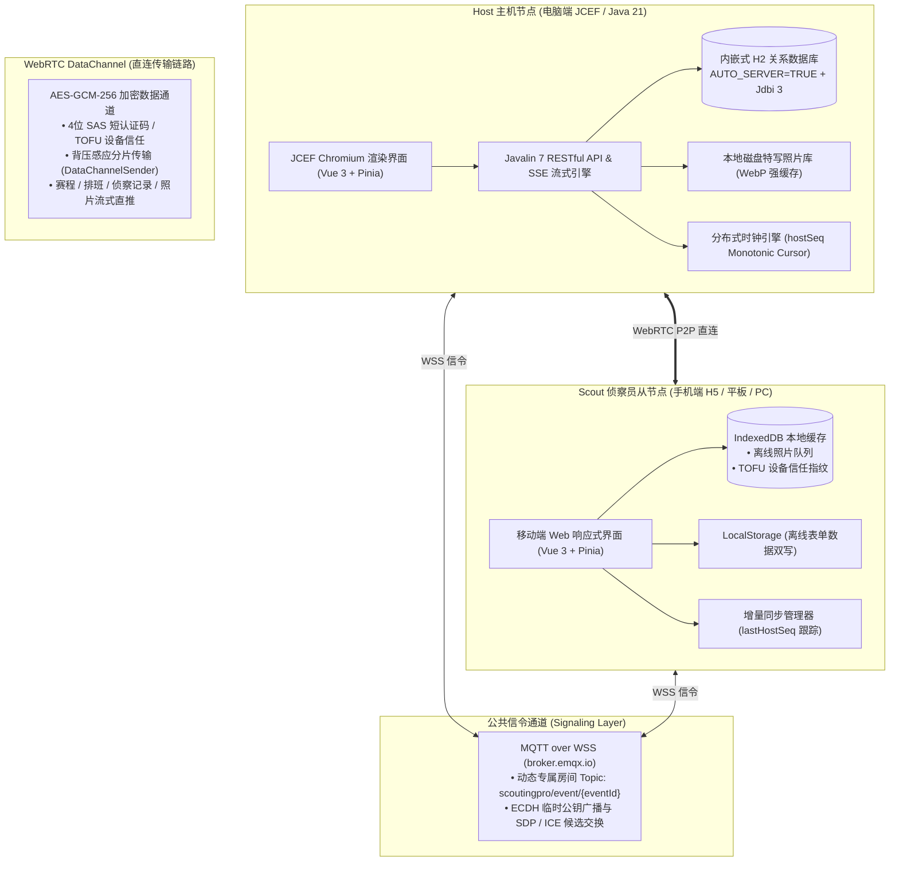
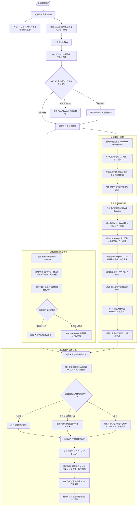
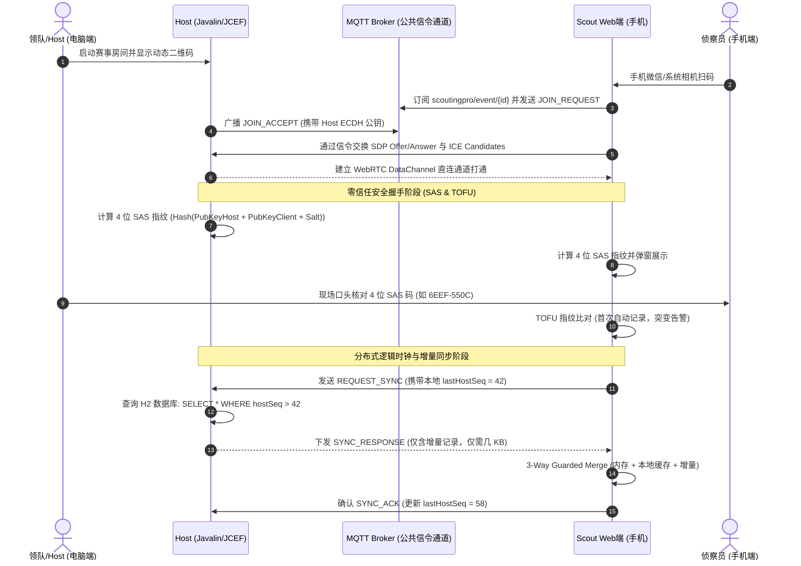
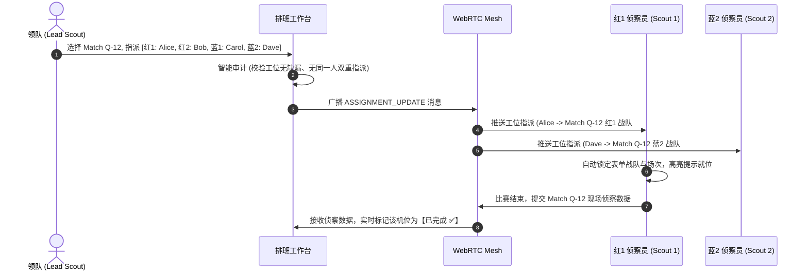
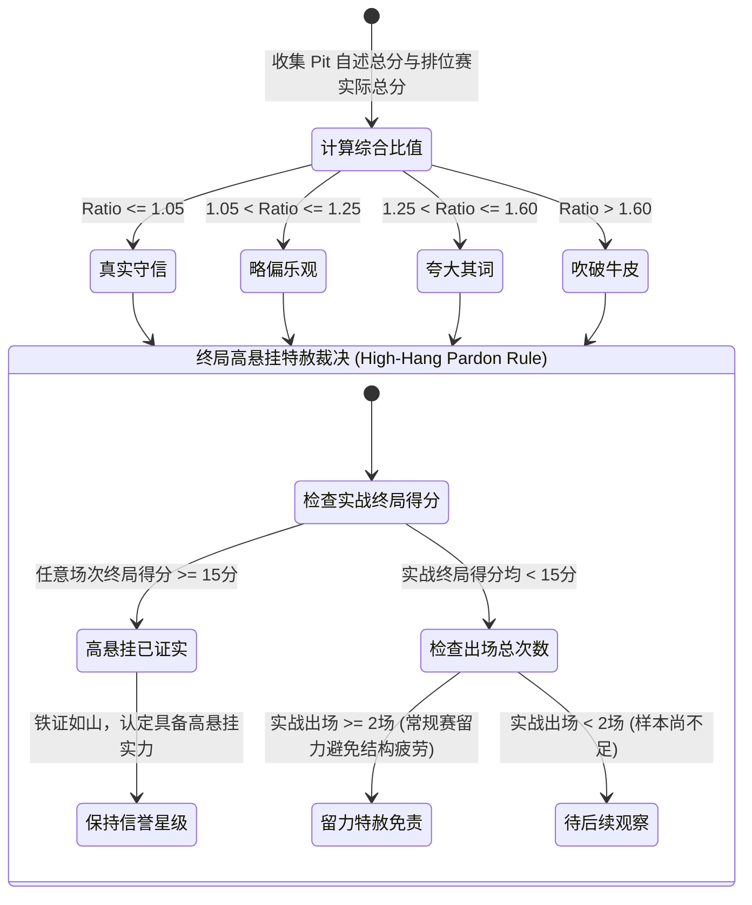
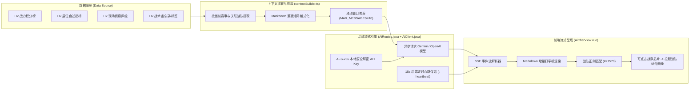

# ScoutingPro27 🚀

<p align="left">
  
  
  
  
  
  
  
  
</p>

**ScoutingPro27** 是一款专为 **FIRST Tech Challenge (FTC)** 机器人赛事打造的**离线优先、去中心化分布式赛事侦察、赛程排班与战力智能分析桌面/移动协同系统**。

在赛场极其恶劣的网络条件（Wi-Fi 严重干扰、移动网络对称 NAT 隔离、基站限流）下，系统基于本地嵌入式 H2 数据库与 WebRTC 点对点直连技术，为车队提供毫秒级多端增量同步、量化展位侦察 (Pit Scouting)、智能排班指派、基于官方成绩的队伍“吹牛指数”对账分析，以及搭载流式 SSE 的战术 AI 助手。

无需自建云端服务器、无需部署 Docker，双击即可在单机或多设备局域网/互联网中即时组网运行。

---

## 🌟 核心功能矩阵 (Features)

### 1. 离线优先的多端协同组网
- **无公网依赖**：数据完整驻留本地嵌入式 H2 数据库中。设备间通过 WebRTC DataChannel 点对点直连，网络中断时本地全功能运行，网络恢复后毫秒级增量双向同步。
- **移动端扫码秒级接入**：Host 主机一键生成携带内网 IP 的动态二维码，手机端侦察员无需下载任何客户端，微信/系统相机扫码即以 Web 端无缝接入。

### 2. 赛事赛程与侦察员智能排班 (Match Schedule & Assignments)
- **赛程导入与管理**：支持从 FTC 官方 API 一键同步或自定义导入资格赛/淘汰赛赛程，自动解析红一/红二/蓝一/蓝二联盟战队。
- **动态排班工作台**：支持为每场比赛的 4 个工位灵活指派侦察员；支持持久“留空”模式，排班变动实时通过 WebRTC 广播同步到所有侦察员屏幕。

### 3. 量化展位侦察与特写照片系统 (Quantified Pit Scouting & Photos)
- **标准量化自述指标**：细致记录各战队底盘构型（麦轮/全向/西海岸）、机械臂结构、悬挂类型、测距传感器配置，以及自主、手动、终局各阶段量化自述指标。
- **分层混合照片资产管理**：电脑端直接流式落盘到本地磁盘，手机端采用 IndexedDB 异步队列缓冲，支持弱网环境下的断点续传与静默批量回传。

### 4. 战力天梯榜与“吹牛指数”量化对账 (Brag Index Analytics)
- **吹牛指数 (Brag Index) 算法**：将战队在 Pit 展位填报的“自述数据”与天梯赛实际得分进行多维动态对账，自动划分【真实守信 🎯】、【略偏乐观 🟡】、【夸大其词 ⚠️】与【吹破牛皮 🔥】四档，并内置“高悬挂留力”特赦核验机制。
- **官方数据交叉验证**：直连 FTC 官方数据平台核实战队真实表现，侦察员历史误报率超过 20% 时自动启动可信度降权防线。

### 5. 零信任 P2P 安全加固与防篡改体系
- **ECDH 密钥协商与 4 位短认证码 (SAS)**：WebRTC 建联时双方自动生成临时公私钥并推导共享密钥，生成 4 位可视短认证码防范中间人攻击（MITM）。
- **TOFU (Trust-On-First-Use) 设备资产信任**：首次连接设备自动建档存入 IndexedDB，后续连接自动认证；遇到公钥突变（重装或冒充）时触发高危告警阻断。
- **会话防篡改与接管仲裁**：防范冒充他人 ID 提交记录；同名登录自动建议重命名，同用户跨设备登录支持授权接管与 30s 冷却超时防抖。

### 6. 流式赛事战术 AI 助手 2.0 (Tactical AI Engine)
- **双引擎多模型支持**：原生适配 Google Gemini 与 OpenAI 系模型，密钥本地 AES-256 对称加密安全存储。
- **全赛事实时数据注入**：动态提取当前赛事排位、战队自述、历史战绩与标签作为 Context 注入 Prompt。
- **SSE 流式打字机与心跳保活**：基于 Server-Sent Events 实现流式输出，内置 15s 后端心跳守护；支持 Markdown 表格渲染与战队编号正则捕获（点击战队编号即刻拉起战队详尽档案抽屉）。

---

## 🛠️ 架构蓝图与协同拓扑 (Architecture & System Topology)

ScoutingPro27 采用**离线优先的去中心化分布式架构**。主机端以 JCEF (Java Chromium Embedded Framework) 桌面容器为核心，承载 Javalin 7 本地微服务、H2 嵌入式关系数据库与磁盘文件存储；客户端支持手机移动端浏览器或轻量桌面端扫码直连，节点间通过 WebRTC DataChannel 构成去中心化数据交互网。



---

## 🔄 核心业务逻辑与流转流程图 (Business Logic & Workflows)

ScoutingPro27 覆盖 FTC 赛事的全生命周期，从**赛前展位建档、赛程排班**到**赛中四机位同步采集、离线落盘**，再到**赛后吹牛指数对账、战术 AI 辅助决策**，各模块环环相扣。

### 1. 全生命周期业务流转闭环 (End-to-End Tournament Lifecycle)



### 2. P2P 零信任建联与单调游标增量同步时序 (Security & Monotonic Sync Flow)



### 3. 四机位排班矩阵与现场侦察派单时序 (Match Station Assignment Flow)



### 4. “吹牛指数”量化对账与高悬挂留力特赦状态机 (Brag Index State Machine)



### 5. 流式战术 AI 助手数据流转链路 (Tactical AI 2.0 Pipeline)



---

## 🗂️ 前后端核心源码与架构映射索引 (Codebase Architecture Map)

| 核心业务领域 | 前端实现 (Vue 3 / TypeScript / Pinia) | 后端实现 (Java 21 / Javalin 7 / H2 / Jdbi) | 核心职责与数据不变量 |
|---|---|---|---|
| **网络直连与信令** | `services/webrtc.ts`<br/>`services/mqttSignaling.ts`<br/>`services/dataChannelSender.ts` | `routes/WebRtcRoutes.java` | P2P 穿透、背压感应分片传输、看门狗重协商 |
| **零信任加密与安全** | `services/crypto.ts`<br/>`services/identityStore.ts`<br/>`common/SasVerificationModal.vue` | `util/AESUtil.java` | ECDH P-256 密钥协商、4位 SAS 认证码、TOFU 持久化 |
| **赛程与排班工作台** | `stores/schedule.ts`<br/>`components/schedule/ScheduleManager.vue`<br/>`components/schedule/ScheduleAuditModal.vue` | `routes/ScheduleRoutes.java`<br/>`dao/ScheduleDao.java`<br/>`model/ScoutAssignment.java` | 赛程导入、4机位矩阵指派、缺员冲突审计 |
| **实战侦察数据采集** | `stores/records.ts`<br/>`components/scouting/ScoutingForm.vue`<br/>`utils/offlineSync.ts` | `routes/RecordRoutes.java`<br/>`dao/RecordDao.java`<br/>`model/ScoutingRecord.java` | 自主/手动/终局量化打分、三向防冲合并 (3-Way Merge) |
| **展位侦察与照片存储** | `stores/pitScout.ts`<br/>`components/pit/PitScoutView.vue`<br/>`services/photoStorage.ts`<br/>`services/indexedDb.ts` | `routes/PitScoutRoutes.java`<br/>`dao/PitScoutDao.java`<br/>`util/PhotoStorageUtil.java` | 机构量化填报、电脑端物理磁盘落盘、手机端 IndexedDB 队列 |
| **天梯榜与吹牛指数** | `views/TeamDetailView.vue`<br/>`components/rankings/RankingsTable.vue`<br/>`utils/bragIndex.ts` | `dao/RecordDao.java`<br/>`dao/PitScoutDao.java` | 自述 vs 实测动态对账、高悬挂留力特赦判定 |
| **战术 AI 助手 2.0** | `components/ai/AiChatView.vue`<br/>`components/ai/contextBuilder.ts`<br/>`components/ai/useAiChatStream.ts` | `routes/AiRoutes.java`<br/>`util/AiClient.java`<br/>`dao/AiChatSessionDao.java` | 赛事上下文注入、SSE 流式打字机、15s 后端心跳保活 |

---

## 🛡️ 用户信息安全与零信任联网同步机制 (Information Security & Zero-Trust Sync Matrix)

在激烈的机器人锦标赛与商业技术竞赛中，**战队的核心战术数据、机器人技术缺陷照片、对手战力评级与联盟挑选策略属于最高机密**。ScoutingPro27 将**用户信息安全与通信抗对抗能力**置于系统架构的最高优先级，构建了业内领先的**零信任（Zero-Trust）多层防御矩阵**：

```
+---------------------------------------------------------------------------------------------------+
|                                ScoutingPro27 零信任纵深防御安全矩阵                                |
+---------------------------------------------------------------------------------------------------+
|  [物理数据主权] 100% 本地嵌入式持久化 | 零公网云盘/数据库依赖 | 赛场断网物理级数据隔离            |
|  [通道加密防护] ECDH (P-256) 密钥协商 | HKDF 派生密钥 | AES-256-GCM 逐包信令与载荷全密文传输       |
|  [防嗅探与防篡改] 基于房间盐值的 HMAC-SHA256 载荷验签 | 规范化键序防参数篡改                      |
|  [防重放与注入] 随机 Nonce + ±30s 时间戳窗口 | 5000 容量 NonceLruCache 内存硬核拦截              |
|  [防中间人攻击] 4位/8位 SAS 可视短认证码 (Short Authentication String) | 物理核验建立信任锚点     |
|  [设备资产认证] TOFU (Trust-On-First-Use) 设备资产库 | 会话级公钥突变 (Key Flapping) 秒级切断熔断 |
|  [身份防伪造] (eventId, userId, deviceId) 三元组主键 | 30s 冷却授权接管仲裁机制                   |
|  [凭据本地保护] AI 模型 API Key 本地 AES-256 硬件/派生加密 | 内存解密调用，绝不上行广播           |
+---------------------------------------------------------------------------------------------------+
```

### 1. 物理级数据主权：零云端泄露隐患
- **无中心化云服务器**：传统侦察软件常将数据上传至公有云或第三方数据库，极易面临数据被爬取、撞库或外泄的风险。ScoutingPro27 坚持**离线优先原则**，所有的战队自述数据、现场打分、特写高清大图与战术备忘录**100% 完整驻留在队伍电脑的内嵌式 H2 数据库和本地物理磁盘**中。
- **公网 MQTT 仅为“盲信令管道”**：用于节点发现的公网 MQTT Broker 仅作为打洞握手时的盲转交中继（Blind Relay），信道内流转的数据均经端到端加密，中继服务器无从知晓任何战术与用户信息。

### 2. 传输层前向保密加密体系 (ECDH P-256 + HKDF + AES-256-GCM)
- **临时密钥协商**：两端初始化时通过 Web Crypto API 动态生成椭圆曲线临时密钥对（ECDH P-256）。
- **高熵派生与会话隔离**：通过对端公钥与本地私钥推导共享比特，再经 **HKDF-SHA256** 派生出 256 位的专属 AES-GCM 会话密钥。
- **AES-256-GCM 全程加密**：DataChannel 建立前的信令交换全部采用 AES-256-GCM 认证加密传输，每个数据包均带有独立的随机 12 字节 IV，即便赛场 Wi-Fi 被恶意嗅探或镜像抓包，攻击者也仅能看到高熵随机密文。

### 3. 防重放攻击与防篡改验证 (HMAC-SHA256 + Nonce LRU Cache)
- **规范化键序签名**：信令载荷在发出前，会自动剔除签名键并按字典序重排，通过基于邀请码与房间盐值派生的 HMAC-SHA256 进行严格签名，彻底消除参数污染与中间人篡改。
- **双重防重放防线**：
  1. **时间戳窗口校验**：强制校验数据包时间戳与当前系统时间的偏差（$|T_{\text{now}} - T_{\text{pkg}}| \le 30\text{s}$），逾期数据包立即丢弃；
  2. **LRU 随机数去重**：维护容量为 5000 的 `NonceLruCache`，对每个随机 Nonce 记录入库，一旦检测到已处理的 Nonce 立即拒绝，杜绝赛场无线电嗅探者的重放攻击。

### 4. 防中间人攻击 (MITM)：4 位 SAS 短认证码
- **算法模型**：
  $$\text{SAS} = \text{SHA-256}(\min(\text{PubKey}_A, \text{PubKey}_B) \mathbin{\Vert} \text{":"} \mathbin{\Vert} \max(\text{PubKey}_A, \text{PubKey}_B) \mathbin{\Vert} \text{":"} \mathbin{\Vert} \text{InviteCode})$$
- **可视指纹物理核验**：双方依据各自协商的公钥与房间邀请码，在各自屏幕上衍生出一致的 4 位十六进制短认证码（如 `6EEF-550C`）。
- 侦察员扫码入网时，领队与侦察员只需在赛场现场目测核对这 4 位代码，即可在不依赖任何第三方 CA 证书体系的前提下，以密码学方式彻底击碎针对 WebRTC 的中间人替换攻击。

### 5. TOFU (Trust-On-First-Use) 设备资产信任与突变熔断
- **持久化设备身份标识**：每台终端生成唯一的 `deviceId` 与私钥对，保存在浏览器隔离的 IndexedDB (`scoutingpro_security_v1`) 中，刷新或重启不会丢失。
- **首次连入自动建档**：首度配对成功后，系统自动将对端公钥记录为基线指纹。后续连接自动免密放行，保障赛场无感流畅交互。
- **公钥突变秒级熔断 (Key Flapping Protection)**：若同一设备在活跃会话中突然出示不一致的公钥（典型的中间人注入特征），系统立即触发 **CRITICAL 红色安全熔断**，瞬间切断 DataChannel 数据通道并弹窗阻断，杜绝未授权劫持。

### 6. 身份防冒充与跨设备会话接管仲裁
- **三元组主体绑定**：信任记录以 `(eventId, userId, deviceId)` 为复合主键，准确识别侦察员更换手机或平板操作的合法行为。
- **接管防抖与仲裁**：当同名侦察员从新设备连入时，系统触发 30s 冷却弹窗仲裁确认，原设备收到授权提醒，防止场外人员冒充他人姓名恶意覆盖侦察数据。

### 7. 本地敏感凭据防护 (AES-256)
- AI 战术助手接入所需的 Google Gemini 或 OpenAI API Key 绝不上行传输，均通过 Java 后端本地 AES-256 算法加密存储在 H2 数据库中，仅在后端发起推理请求时于内存中解密，全面护航车队隐私资产。

---

### 亮点一：分布式逻辑时钟与增量同步机制 (Host Monotonic Sequence)
- **运行逻辑**：摒弃跨设备本地时钟极易偏差（时区、设备时间不准）的时间戳同步方案，改由 Host 统一下发全局严格单调递增的逻辑游标 `hostSeq`。
- **断线增量补偿**：从机本地持久化记录上次确认的 `lastHostSeq`。网络重连后，Client 只需发起 `REQUEST_SYNC(sinceVersion = lastHostSeq)`，Host 仅检索过滤出 `hostSeq > sinceVersion` 的增量记录，单次同步数据量从全量几百 KB 骤降至几 KB，保障弱网秒级恢复。
- **防覆灭三向合并 (3-Way Guarded Merge)**：客户端页面刷新（F5）或后端重启时，通过 `records.ts` 执行内存、LocalStorage 与后端查询的三向合并，确保高版本内存记录绝不被空库或旧库冲掉。

### 亮点二：零信任 P2P 通信与 SAS / TOFU 安全矩阵
- **ECDH 密钥协商**：两端初始化时通过 Web Crypto API 动态生成椭圆曲线临时密钥对（ECDH P-256），信令传输使用协商后的 AES-GCM 密钥加密。
- **短认证码 (SAS Fingerprint)**：双方依据各自公钥与赛事邀请码哈希衍生 4 位 16 进制指纹码（如 `6EEF-550C`）。侦察员在赛场现场目测核对即可物理阻断信令劫持与中间人嗅探。
- **TOFU 信任持久化**：设备首次配对后自动将设备指纹存入 IndexedDB（`identityStore.ts`）。再次建联时比对历史指纹自动放行；一旦检测到公钥突变（Key Flapping），系统立即冻结 DataChannel 消息收发，阻断未授权接入。

### 亮点三：自愈型 ICE 穿透与看门狗降级 (Self-Healing ICE Watchdog)
- **穿透梯度机制**：ICE 优先探测局域网直连（host candidate）→ 公网 STUN 反射（srflx candidate）→ TURN 中继（relay candidate）。
- **智能看门狗计时器**：
  - 若连接处于 `checking` 状态超过 3.5 秒，触发网络抖动提示；
  - 停滞超过 5.5 秒，自动触发 `pc.restartIce()` 进行备用地址重协商（支持最多 2 次重启）；
  - 若 2 次尝试后仍受阻（赛场高对称 NAT 拦截 UDP 报文），看门狗主动销毁当前连接，直接注入 `iceTransportPolicy: 'relay'` 强制启用 Metered.ca TURN 中继建立链路，实现极端网络下的自愈建联。

### 亮点四：分层混合持久化存储架构 (Hybrid Persistence Layer)
- **电脑 Host 端**：依托 Java 21 原生进程运行内嵌式 **H2 数据库**（开启 `AUTO_SERVER=TRUE` 模式），搭配 Jdbi 3 处理高吞吐并发事务；展位大图采用 WebP 压缩后直接流式存储在电脑物理磁盘中，利用 HTTP 强缓存（`Cache-Control: immutable`）实现零内存损耗加载。
- **移动 Scout 端**：浏览器环境通过封装的 **IndexedDB**（`indexedDb.ts` 与 `mobilePhotoCache.ts`）维护离线照片缓冲队列；业务数据通过防抖监听持久化于 `localStorage`，并在网络畅通时静默回传电脑主机。

### 亮点五：“吹牛指数”动态对账与高悬挂特赦算法 (Brag Index)
- **量化对账模型**：战队在 Pit 填报的自述总分、自主分、手动分与实际排位赛的平均分及最高分进行动态比对：
  $$\text{OverallRatio} = \frac{\text{ClaimedTotalScore}}{\max(\text{MaxActualScore}, \text{AvgActualScore} \times 1.05, 1)}$$
- **高悬挂机构特赦机制 (High-Hang Pardon Rule)**：针对 FTC 机器人高悬挂装置在常规赛中“结构复位极其繁琐、战队选择留力”的工程实际，算法设定：
  1. 只要战队在任意一场实际比赛中展现过高悬挂能力（终局得分 $\ge 15$ 分），即铁证如山，直接点亮【高杠已证实 🧗】；
  2. 若打满 $\ge 2$ 场仍未挂出，系统判定为常规赛留力，自动予以【特赦免责】，不直接扣除信誉分，避免算法脱离赛事实情。

### 亮点六：流式 SSE 战术 AI 助手与赛事上下文智能融合
- **服务端事件流 (SSE)**：基于 Javalin 异步上下文与 HTTP 响应流，配合后端单线程定时调度器每 15 秒输出 `: heartbeat\n\n` 保持连接，彻底解决移动端弱网或长耗时推理导致的连接中断。
- **智能滑动窗口 (Sliding Window)**：采用 `MAX_CONTEXT_MESSAGES = 10` 对历史轮次进行动态修剪，避免 Token 爆炸与超长计费。
- **实体高亮联动**：前端 Markdown 渲染引擎配合自定义正则捕获模型返回的战队编号（如 `#27570` 或 `Team 25787`），自动渲染为可交互战队芯片，点击即刻通过 Pinia 状态树滑出该战队的综合能力抽屉。

---

## 💻 快速开始与运行指南 (Getting Started)

### 环境要求
- **后端运行**：JDK 21+，Maven 3.8+
- **前端开发**：Node.js 18+，npm 9+
- **网络环境**：用于设备发现与信令交换的互联网络（赛场内网可连接外网 MQTT 即可）

### 方式一：开发调试模式 (前后端独立启动)

1. **后端启动 (Javalin REST + H2)**
   ```powershell
   cd Backend
   mvn clean compile exec:java -Dexec.mainClass="com.bear27570.app.Main" -Dexec.args="--headless --port=8080"
   ```
   > 提示：`--headless` 参数会跳过 JCEF 桌面窗口，仅启动后台 RESTful 接口与嵌入式 H2 数据库。

2. **前端启动 (Vite Dev Server)**
   ```powershell
   cd frontend
   npm install
   npm run dev
   ```
   浏览器访问 `http://localhost:5173` 即可进入系统。

### 方式二：生产桌面一体化模式 (JCEF 独立桌面程序)

1. **构建前端产物**
   ```powershell
   cd frontend
   npm run build
   ```
   构建产物将自动输出至 `Backend/src/main/resources/public`。

2. **编译打包后端可执行 JAR**
   ```powershell
   cd ../Backend
   mvn clean package -DskipTests
   ```

3. **双击运行桌面应用**
   ```powershell
   java -jar target/ScoutingPro27-1.0-SNAPSHOT.jar
   ```
   系统将自动完成数据库 Flyway 迁移、加载 JCEF 原生 Chromium 渲染内核并淡入主界面。

### 方式三：赛场现场单机多开演练 (Multi-Client Simulation)
系统原生支持单台电脑同时启动多个实例（1 个 Host 房间端 + 多个 Scout 客户端）：
- **端口冲突自愈**：当默认 8080 端口被占用时，后续实例会自动按 8081 -> 动态空闲随机端口降级启动；
- **JCEF 缓存隔离**：每个进程分配独立的 `scoutingpro-jcef-<uuid>` 临时缓存目录，杜绝 Chromium 多进程排他锁死；
- **H2 数据库并发代理**：基于 `AUTO_SERVER=TRUE`，首个进程启动嵌入式引擎，后续实例自动通过 TCP 代理并发读写。

---

## ⚙️ 核心配置与环境变量

| 配置项 / 变量名 | 默认值 | 作用说明 |
|---|---|---|
| `DEV_PORT` / `--port=N` | `8080` | 指定本地 Javalin 服务监听端口 |
| `SCOUTING_ENV` / `app.env` | `DEV` / `PROD` | 运行环境标识；开发环境下数据存放在 `app_data/`，生产环境下统一存放在 `~/.scoutingpro27/` |
| `DB_URL` | 自动解析 | 自定义 H2 数据库 JDBC 连接字符串 |
| `ENABLE_TEST_CLEANUP` | `false` | 是否开启集成测试数据重置接口 (`/api/test/cleanup`) |

---

## 🧪 测试与质量保障 (Verification & Testing)

项目遵循严格的**证据闭环与全链路验证铁律**：

```powershell
# 1. 运行后端完整单测 (77 项单测全部绿灯)
cd Backend
mvn test

# 2. 运行前端 Vitest 单元与组件测试 (231 项单测全部通过)
cd ../frontend
npm test -- --run

# 3. 运行前端 TypeScript 静态编译与强类型检查
npm run type-check

# 4. 运行 Puppeteer 端到端多端并发模拟测试
node e2e/multi-client.test.js
```

配套的 **`MANUAL_TESTING_CHECKLIST.md`** 详细列出了真实比赛前必须执行的 10 项物理环境人工验收清单（包括真实 4G/5G 移动蜂窝网络下的 TURN 中继穿透、手机扫码离线拍照与静默回传、高悬挂对账特赦判定等）。

---

## ⚠️ 已知限制与使用建议

1. **信令与 TURN 免费额度**：MQTT broker (`broker.emqx.io`) 与 Metered.ca TURN 中继属于公共服务，重度使用需关注流量配额，正式比赛建议车队自建小型 MQTT/TURN 节点。
2. **NAT 穿透边界**：STUN 直连取决于赛场局域网与运营商 NAT 类型（对称型 NAT 需依靠 TURN 中继兜底）。
3. **正式比赛前建议**：在比赛前一天，使用物理隔离的双手机移动热点与电脑进行一次实操演练，确认 TURN 链路畅通。

---

## 🎨 视觉与设计资产

- 应用内图标：**Google Material Icons**
- 视觉排版字体：**Manrope** & **Orbitron**

---

> *Crafted with ❤️ by FTC Team 27570 B.E.A.R. & 25787 TechBY*
