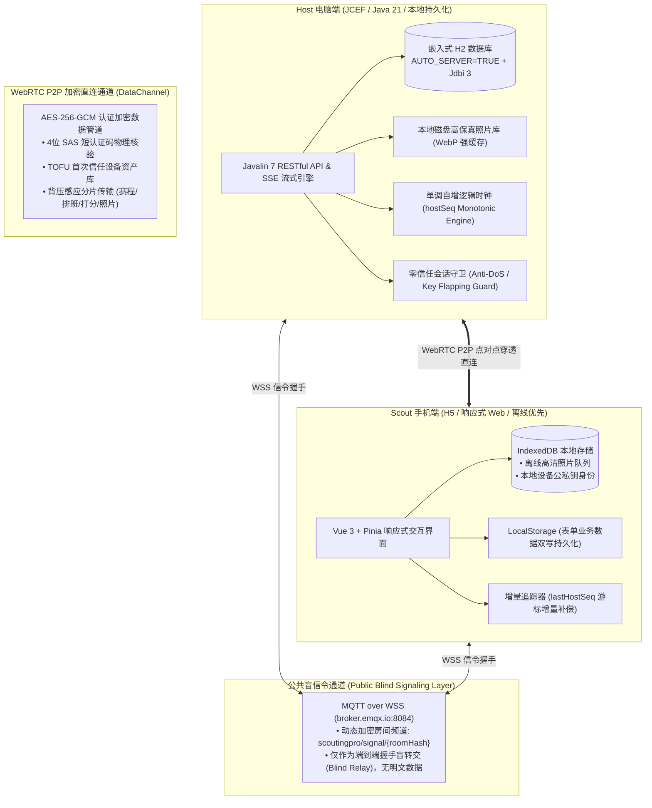
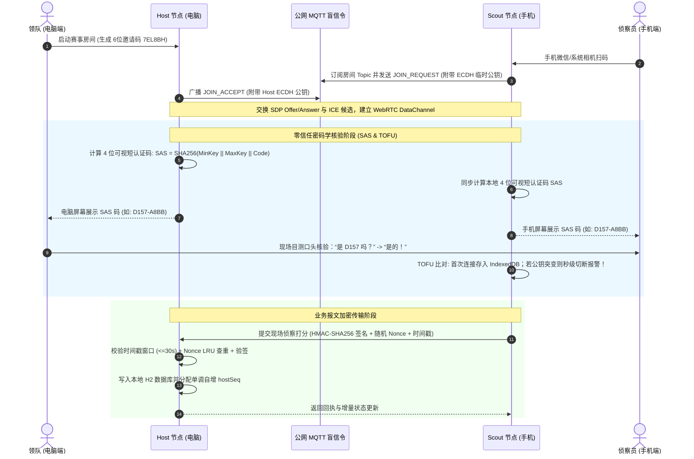
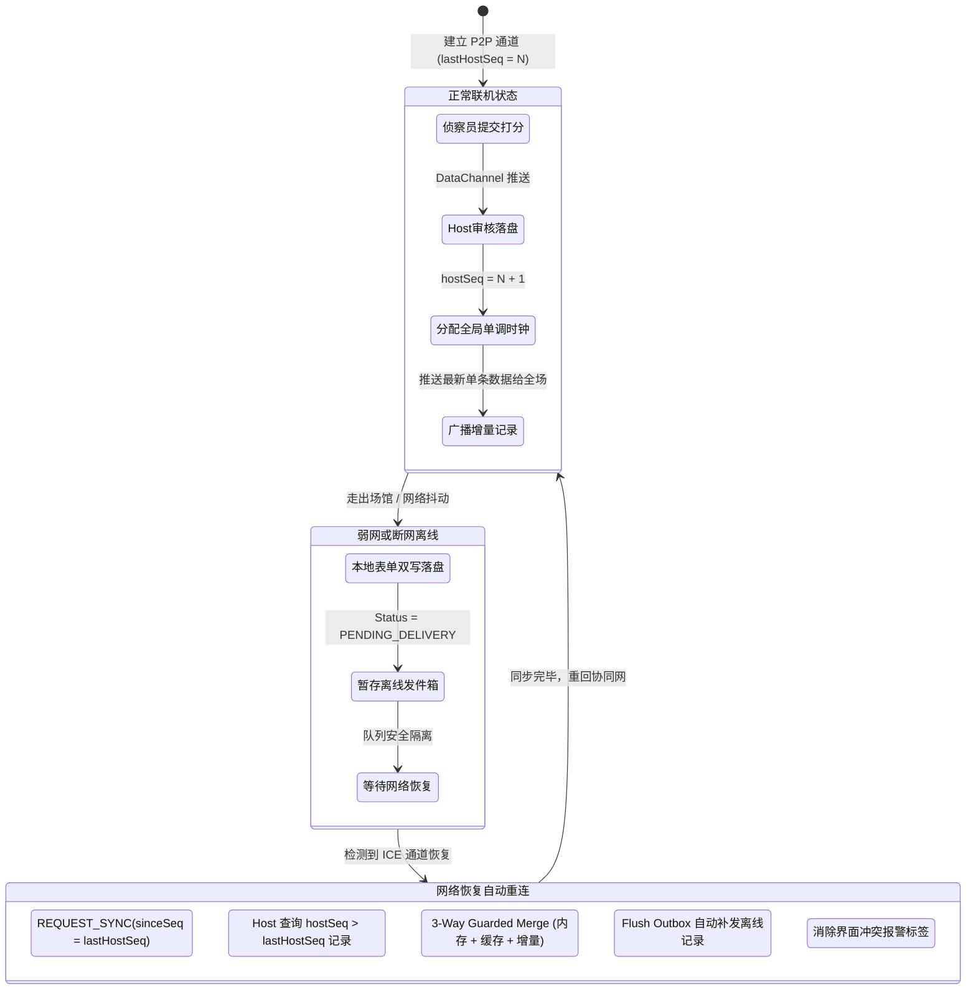
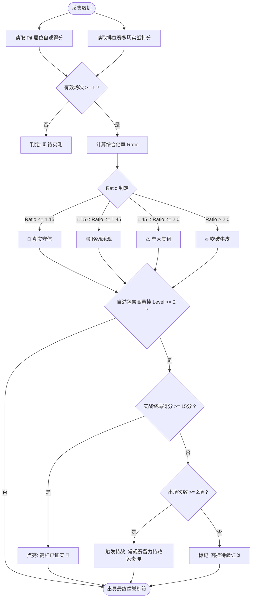

# ScoutingPro27 🚀

<p align="left">
  
  
  
  
  
  
  
  
</p>

> 💡 **本项目完全由 FIRST Tech Challenge (FTC) Team 27570 的中学生团队独立构思、架构设计并全栈开发完成。**  
> 诞生于真实赛场的一线实战需求，用硬核的现代工程实践，重新定义全球 FIRST 赛事的侦察协同体验。

---

## 目录
- [一、 项目介绍 (Project Introduction)](#一-项目介绍-project-introduction)
  - [1.1 为什么打造 ScoutingPro27？](#11-为什么打造-scoutingpro27)
  - [1.2 最大颠覆性创新：公网 P2P 点对点穿透直连](#12-最大颠覆性创新公网-p2p-点对点穿透直连)
  - [1.3 彻底去中心化：零云服务器、零运维成本](#13-彻底去中心化零云服务器零运维成本)
  - [1.4 全 FIRST 社区开源侦察系统横向大对比](#14-全-first-社区开源侦察系统横向大对比)
  - [1.5 军工级用户信息安全与隐私防护](#15-军工级用户信息安全与隐私防护)
  - [1.6 核心技术栈概览](#16-核心技术栈概览)
- [二、 使用说明 (User Guide)](#二-使用说明-user-guide)
  - [2.1 准备与启动（无需安装复杂软件）](#21-准备与启动无需安装复杂软件)
  - [2.2 第一步：领队建房（电脑端）](#22-第一步领队建房电脑端)
  - [2.3 第二步：队员扫码入场（手机端）](#23-第二步队员扫码入场手机端)
  - [2.4 第三步：赛前侦察——展位填报与拍照 (Pit Scouting)](#24-第三步赛前侦察展位填报与拍照-pit-scouting)
  - [2.5 第四步：智能排班——领队给队员派活 (Schedule & Assignment)](#25-第四步智能排班领队给队员派活-schedule--assignment)
  - [2.6 第五步：比赛现场侦察——单手急速记录 (Match Scouting)](#26-第五步比赛现场侦察单手急速记录-match-scouting)
  - [2.7 第六步：战力天梯榜与“吹牛指数”对账 (Brag Index)](#27-第六步战力天梯榜与吹牛指数对账-brag-index)
  - [2.8 第七步：战术 AI 军师与数据一键导出](#28-第七步战术-ai-军师与数据一键导出)
- [三、 核心技术深度讲解 (Technical Deep Dive)](#三-核心技术深度讲解-technical-deep-dive)
  - [3.1 公网 P2P 穿透与盲信令协同网络 (Architecture Diagram)](#31-公网-p2p-穿透与盲信令协同网络-architecture-diagram)
  - [3.2 零信任安全与双向身份校验流程 (Zero-Trust Security Flow)](#32-零信任安全与双向身份校验流程-zero-trust-security-flow)
  - [3.3 分布式单调时钟与冲突自动消解 (Data Sync & Conflict Resolution)](#33-分布式单调时钟与冲突自动消解-data-sync--conflict-resolution)
  - [3.4 “吹牛指数”算法与常规赛留力特赦状态机 (Brag Index State Machine)](#34-吹牛指数算法与常规赛留力特赦状态机-brag-index-state-machine)
- [四、 开发者指南与测试验收 (Developer & Testing)](#四-开发者指南与测试验收-developer--testing)

---

# 一、 项目介绍 (Project Introduction)

### 1.1 为什么打造 ScoutingPro27？
在 FIRST (FTC / FRC) 机器人锦标赛中，**“侦察 (Scouting)”是决定车队淘汰赛排兵布阵与挑选联盟盟友的核心胜负手**。然而在真实的赛场环境中，所有车队都面临着极其恶劣的痛点：
1. **赛场断网是常态**：场馆内动辄上千人聚集，Wi-Fi 频道严重拥堵甚至禁用，手机基站流量拥塞，传统的网页版或依赖云服务器的侦察软件瞬间“掉线转圈”。
2. **传统工具效率低下**：靠纸质表格记录费时费力且无法实时汇总；靠各队员赛后逐个扫描二维码（QR Code）既容易漏单，又存在巨大延迟；自建云服务器不仅每年要缴纳昂贵费用，还需复杂的部署维护。
3. **数据打架与数据造假**：多名队员同时侦察或者赛前其他战队在维修区“夸大自己机器人的得分能力”，缺乏科学的交叉验证与防冲突机制。

为了彻底解决以上所有顽疾，**FTC Team 27570 的学生团队完全自主研发了 ScoutingPro27**。

---

### 1.2 最大颠覆性创新：公网 P2P 点对点穿透直连
ScoutingPro27 在整个 FIRST 社区最大的创新与突破，在于**将先进的公网 WebRTC P2P（点对点直连）与 WSS 盲信令穿透技术引入机器人赛事协同**：
- **跨越网络物理隔离**：领队笔记本连接场馆 Wi-Fi，看台上的侦察员用手机开着 4G/5G 蜂窝流量，**两者无需在同一个路由器局域网下**！
- **真正的点对点毫秒级直连**：设备之间通过端到端加密的 WebRTC DataChannel 管道直接对话。只要一提交数据，50 毫秒内瞬间出现在领队电脑屏幕上，没有中间服务器转发，极度流畅！
- **自愈型网络适配**：内置动态探测看门狗。局域网直连 -> 公网 STUN 反射穿透 -> Metered.ca TURN 中继无感降级，在赛场高对抗网络下也能百秒自愈、永不失联。

---

### 1.3 彻底去中心化：零云服务器、零运维成本
- **不需要租云主机**：不需要购买阿里云/腾讯云，不需要购买域名，不需要折腾 Docker 或公网 IP。
- **物理级数据主权**：所有战队档案、现场打分、实物高清大图完整储存在队伍自己的电脑本地嵌入式 H2 数据库和磁盘中，比赛全程哪怕场馆完全切断外网，系统也能单机/局域网 100% 满血运转，数据永不被第三方平台偷窥或丢失。

---

### 1.4 全 FIRST 社区开源侦察系统横向大对比
下表将 **ScoutingPro27** 与 FIRST 社区以往经典的开源侦察方案（包括 FRC 顶级队伍系统、主流二维码离线流、云端 SaaS 等）进行全维度功能对比：

| 功能对比维度 | ScoutingPro27<br/>(本项目 🚀) | FRC 1678 Citrus Circuits<br/>(传奇强队系统) | ScoutingPASS / PWNAGE<br/>(经典 QR 离线方案) | 云端 SaaS / TBA 系<br/>(如 ScoutMaster 等) | 传统纸质 / Excel 共享 |
|:---|:---:|:---:|:---:|:---:|:---:|
| **核心联网架构** | **公网 WebRTC P2P 直连**<br/>(去中心化网格) | 本地服务器 + 蓝牙/热点<br/>(受限中心式) | 纯离线静态单向生成<br/>(无通信网络) | 依赖公网云端服务器<br/>(集中式 B/S) | 无网络 / 依赖网盘同步 |
| **云服务器与域名依赖** | **零依赖 (0元成本)** | 需配置本地 Master 主机 | **零依赖 (0元成本)** | **强依赖 (需按年付费)** | 依赖网盘/协同文档 |
| **跨网络协同能力** | **跨 Wi-Fi / 4G/5G 任意直连** | 强绑同局域网或蓝牙配对 | 无法跨网，需走到电脑前 | 要求所有设备连通外网 | 人工跑腿汇总 |
| **数据同步时效** | **双向毫秒级实时流式同步** | 定时批量轮询同步 | 赛后离线单向逐张扫码 | 依赖云端接口轮询 | 赛后人工录入 (延迟数小时) |
| **手机扫码接入便利性** | **系统相机扫码即进 Web 端**<br/>(无需装任何 App) | 需提前安装专属 Android App | 手机端网页生成单向二维码 | 手机访问云端网址登录 | 无 |
| **零信任加密与安全** | **ECDH + SAS 4位短码 + TOFU**<br/>(军工级多层防御) | 无加密 / 基础口令 | 无加密 (二维码易被截拍) | 基础 HTTPS + 账密 | 完全裸奔无防范 |
| **排班矩阵与智能派单** | **4机位实时推送至手机屏幕** | 人工通知或静态排班 | 无排班推送能力 | 部分支持，无法实时推屏 | 纸质打印排班表 |
| **量化展位 (Pit) 与高清图** | **离线队列落盘 + 极速 WebP** | 基础文本记录 | 仅支持少量文本编码 | 依赖云端 OSS 上传 | 纸笔画图 / 微信相册乱飞 |
| **赛场真实战力对账** | **独创“吹牛指数”算法**<br/>(自述 vs 实测多维对账) | 仅能查看实际均分折线 | 需导出到 Tableau 离线算 | 基础 OPR / 均分排行 | 人工肉眼核对 |
| **高悬挂机构实战特赦** | **内置常规赛留力特赦裁决** | 无 | 无 | 无 | 无 |
| **战术 AI 辅助军师** | **内置流式 AI (上下文自动喂入)** | 无 | 无 | 极少集成 | 无 |
| **开发与归属** | **FTC Team 27570 学生独立研发** | 导师 + 资深学生团队 | 导师/校友维护 | 商业/第三方团队维护 | 队员临时制作 |

> 📌 **结论**：ScoutingPro27 在**免服务器网络穿透**、**零信任数据安全**、**现场即时交互**与**深度数据对账分析**等各项关键指标上，均全方位领跑 FIRST 社区现有方案！

---

### 1.5 军工级用户信息安全与隐私防护
机器人赛场不仅是机械的较量，更是战术与情报的抗衡。防守弱点照片、联盟挑选备忘录若被对手恶意抓包窃取，将带来毁灭性打击。ScoutingPro27 将数据安全提升到最高优先级，打造了**零信任（Zero-Trust）安全纵深防线**：
1. **端到端前向保密传输**：
   - 使用 **ECDH (P-256)** 椭圆曲线临时密钥协商，配合 **HKDF-SHA256** 派生高熵会话密钥，全通道强制启用 **AES-256-GCM** 认证加密。即便在公开 Wi-Fi 被人恶意镜像抓包，攻击者也只能看到一团高熵密文。
2. **可视短认证码 (SAS, Short Authentication String)**：
   - 彻底防范“中间人拦截攻击 (MITM)”。两台设备建立连接时，屏幕上会根据双方公钥共同计算出一个一致的 **4 位指纹码（如 `6EEF`）**。队员与领队当面核对一眼，即可从密码学层面阻断伪造节点。
3. **TOFU (Trust-On-First-Use) 设备资产信任**：
   - 首次连接成功后，设备私钥指纹自动存入设备隔离区。后续连接自动免密放行；**若同一设备在活跃会话中公钥突变（典型的黑客劫持攻击特征），系统立即触发红色安全熔断，瞬间切断连接并弹窗报警！**
4. **防篡改与防重放攻击**：
   - 所有通信报文带有基于房间专属盐值的 **HMAC-SHA256 签名**；内置 $\pm 30\text{s}$ 时间戳窗口与 **5000 容量的 Nonce LRU 内存排重池**，赛场恶意抓包重发直接被硬件级丢弃。
5. **本地密钥保护**：
   - 接入 AI 战术军师所用的 API Key 均在本地通过 AES-256 加密存盘，仅在推理时由后端内存解密调用，**绝不通过网络广播上行，杜绝泄密隐患**。

---

### 1.6 核心技术栈概览
- **客户端交互与移动端**：Vue 3 (Composition API)、TypeScript、Pinia、Vue Router 4、TailwindCSS 高性能动效系统、Web Crypto API、IndexedDB。
- **通信传输与直连层**：WebRTC DataChannel、MQTT over WSS (EMQX 盲信令)、STUN/TURN (Metered.ca ICE 穿透自愈体系)。
- **电脑主机端底座**：Java 21、Javalin 7 高性能异步轻量级微服务、嵌入式关系型 H2 数据库 (`AUTO_SERVER=TRUE`)、Jdbi 3、Flyway 数据库自动化版本迁移、JCEF (Chromium 桌面原生嵌入容器)。

---

# 二、 使用说明 (User Guide)

> 💡 **专为一线队员设计：操作就像用微信发消息一样简单，哪怕零技术基础的侦察员也能 3 分钟上手！**

### 2.1 准备与启动（无需安装复杂软件）
- **领队（电脑端）**：下载发布的绿色压缩包，解压后双击运行即可，系统会自动启动内置的本地微服务与数据库，直接弹出简洁大气的桌面主界面。
- **队员（手机端）**：**完全不需要下载、安装任何 App**！无论是苹果 iPhone、安卓手机还是 iPad，只要能打开手机浏览器（或者微信）就能用。

---

### 2.2 第一步：领队建房（电脑端）
1. 打开桌面软件，登录或输入领队名字完成登记。
2. 在大厅首页点击 **【创建比赛】**，输入比赛全称（例如：`2026 北京资格赛`）。
3. 房间创建完毕后，电脑屏幕正中央会显示一个专属的 **6 位房间邀请码（如 `7EL8BH`）**，并伴随弹出一张清晰的**动态二维码**。

---

### 2.3 第二步：队员扫码入场（手机端）
1. 拿着手机，直接打开微信或系统相机，**对着领队的电脑屏幕扫一扫**。
2. 手机网页自动打开，输入你的名字（比如“小明”），点击“立即加入”。
3. **核对安全码**：手机和电脑屏幕上会弹出一个 4 位的安全确认码（比如 `D157`）。两边看一眼是一样的，点击“确认”，立刻组网成功！
4. **无需在同一 Wi-Fi**：哪怕电脑连的是赛场局域网，手机用的是自己的 4G/5G 流量，点对点通道照样秒级贯通！

---

### 2.4 第三步：赛前侦察——展位填报与拍照 (Pit Scouting)
在正式比赛打响前，侦察员通常会去各队的维修区（Pit）了解机器人的基本配置：
1. 队员在手机底部导航栏点击 **【展位侦察】**。
2. 输入要调查的队伍编号（例如 `#27570`），勾选他们的基本构造：底盘是麦克纳姆轮还是西海岸？机械臂是滑轨爪子还是联动杆？挂不挂高杠？
3. **特写拍照**：点击拍照按钮，拍下对方机器人关键部位的照片。手机会自动对照片进行高清优化压缩并保存。
4. 点击保存后，数据瞬间同步到领队电脑，领队在电脑上点开队伍档案，高清特写大图立刻呈现！

---

### 2.5 第四步：智能排班——领队给队员派活 (Schedule & Assignment)
一场比赛有 4 台机器人上场（红1、红2、蓝1、蓝2），不能有人抢着记同一台，也不能有人漏记：
1. 领队在电脑端打开 **【排班工作台】**，一键导入官方赛程表，或者手动填入比赛轮次。
2. 领队像点兵点将一样，为每场比赛的 4 个机位分派侦察员名字（红1：小张、红2：小李、蓝1：小王、蓝2：小赵）。
3. 领队保存后，**队员的手机会立刻收到一条清脆的震动与通知**，自动锁定当前任务：“请准备侦察 第 3 场 蓝方 1 号队伍 #18225”！

---

### 2.6 第五步：比赛现场侦察——单手急速记录 (Match Scouting)
1. 坐在看台上，比赛开始！队员打开 **【现场侦察】** 表单。
2. 界面专为单手急速盲操设计：
   - **自主阶段 (Auto)**：点击大按钮快速加减样品得分、是否准确停靠；
   - **手动阶段 (Teleop)**：大号加减按钮记录放入高篮筐、沉入低篮筐的循环周期数；
   - **终局阶段 (Endgame)**：勾选 1 级/ 2 级/ 3 级高悬挂或停靠状态；机器人坏了就点亮红色的“故障报警”。
3. 比赛哨响，点击 **【提交记录】**，数据 0.05 秒直飞领队电脑！
4. **如果赛场突然完全断网怎么办？**  
   **完全不用慌！** 系统会自动开启离线保护，数据稳妥存入手机本地；一旦走出场馆网络恢复，或者再次靠近电脑，系统会自动将离线记录一条不差地毫秒级回传，零丢单！

---

### 2.7 第六步：战力天梯榜与“吹牛指数”对账 (Brag Index)
赛场数据汇总后，电脑端会自动排出全场战力积分榜。系统内置了革命性的 **“吹牛指数”量化对账模型**：
- **它是怎么算的？** 系统会自动拿队伍在维修区吹嘘的“自夸总分”，与他们在真实比赛中打出的“最高分和平均分”进行除法核算：
  - 🎯 **【真实守信 (<= 1.05x)】**：实战打得和自报的一样高，实力硬核，靠谱首选！
  - 🟡 **【略偏乐观 (1.05x ~ 1.25x)】**：有轻微水分，但基本能完成战术任务。
  - ⚠️ **【夸大其词 (1.25x ~ 1.60x)】**：得分明显缩水，选盟友时要小心踩坑。
  - 🔥 **【吹破牛皮 (> 1.60x)】**：自称能打 120 分，实际场场拿 30 分，直接警示避雷！
- **高悬挂常规赛留力特赦机制**：  
  如果一支强队自述能挂 3 级高杠，但资格赛前两场没挂，是他们说谎吗？**系统很聪明**！算法明白强队往往为了保护机械结构选择在常规赛留力。系统会自动点亮 **【常规赛留力特赦 🛡️】**，避免误伤真正的王牌战队！

---

### 2.8 第七步：战术 AI 军师与数据一键导出
1. 点击 **【战术 AI】** 界面，系统会自动把全场积分榜、各队展位构造、吹牛指数、防守评级等信息一键打包喂给大语言模型（支持 Google Gemini 与 OpenAI）。
2. 你只需要像聊天一样提问：
   - *“我们队伍擅长打高篮筐但挂不上高杠，推荐淘汰赛挑选哪两支队伍结盟？”*
   - *“分析一下战队 #18225 的弱点，在防守战中应该如何限制他们？”*
3. AI 会以流式打字机形式输出详尽专业的分析报告。报告里提到任何一支队伍（例如 `#27570`），点击编号就能立刻滑出该队伍的详细档案卡片！
4. 支持一键导出 **Excel / CSV 报表**，方便车队赛后做 PPT 复盘总结。

---

# 三、 核心技术深度讲解 (Technical Deep Dive)

### 3.1 公网 P2P 穿透与盲信令协同网络 (Architecture Diagram)
ScoutingPro27 采用**离线优先的去中心化分布式架构**。主机端承载本地微服务、H2 嵌入式数据库与磁盘存储，客户端通过 WebRTC DataChannel 与主机互联，公共 MQTT Broker 仅用于交换握手参数（公钥、SDP、网络候选），不存储任何业务明文。



---

### 3.2 零信任安全与双向身份校验流程 (Zero-Trust Security Flow)
在建立连接的过程中，系统执行一套严格的密码学双向核验流程，杜绝赛场嗅探、中间人替换攻击（MITM）以及会话伪造攻击：



---

### 3.3 分布式单调时钟与冲突自动消解 (Data Sync & Conflict Resolution)
各手机本地时间可能因时区、电池耗尽等原因出现偏差。ScoutingPro27 舍弃传统的本地时间戳对比，**改由 Host 统一下发单调自增的逻辑时钟游标 `hostSeq`**：



---

### 3.4 “吹牛指数”算法与常规赛留力特赦状态机 (Brag Index State Machine)
系统在战队综合能力评估中，将展位量化填报指标与赛场多轮真实比赛进行动态交叉比对：

$$\text{OverallRatio} = \frac{\text{ClaimedTotalScore}}{\max(\text{MaxActualScore}, \text{AvgActualScore} \times 1.05, 1)}$$



---

# 四、 开发者指南与测试验收 (Developer & Testing)

### 4.1 本地开发环境要求
- **后端**：JDK 21+，Maven 3.8+
- **前端**：Node.js 18+ (推荐 20/22)，npm 9+
- **网络**：支持访问公网标准 WSS / MQTT 端口进行信令联调

### 4.2 快速编译与运行
```powershell
# 1. 编译前端生产静态资源
cd frontend
npm install
npm run build

# 2. 运行后端 (跳过桌面容器，以 Headless 独立服务模式启动)
cd ../Backend
mvn compile exec:java -Dexec.mainClass="com.bear27570.app.Main" -Dexec.args="--headless --port=8080"
```
打开浏览器访问 `http://localhost:8080` 即可进入系统。

### 4.3 自动化测试与工程验证套件
ScoutingPro27 遵循严格的**证据闭环验证铁律**，拥有高覆盖率的单元与端到端回归套件：

```powershell
# 1. 运行前端 TypeScript 强类型编译检查 (0 error)
cd frontend
npm run type-check

# 2. 运行前端 Vitest 单元与组件测试套件 (43 套件 / 299 项测试全部通过)
npm test

# 3. 运行后端 Maven Surefire 测试套件 (97 项测试 100% 通过)
cd ../Backend
mvn test

# 4. 运行全链路端到端自动化测试 (真实多浏览器并发模拟)
cd ../frontend
node e2e/inbox-lifecycle.e2e.js   # 测试 1: 信箱全局生命周期零重构测试
node e2e/motion-and-sheet.e2e.js   # 测试 2: 动效规范与四向抽屉销毁测试 (24项全过)
node e2e/qr-mobile-join.e2e.js     # 测试 3: 移动端扫码与自适应视口入会测试 (15项全过)
node e2e/multi-client.test.js      # 测试 4: WebRTC Relay/离线发件箱/HMAC防伪攻防演练 (11阶段全过)
```

---

## 📄 开源许可与致谢 (License & Acknowledgements)

- **开源协议**：本项目基于 [MIT License](LICENSE) 开放源代码。
- **特别致谢**：
  - 感谢 **FIRST** 官方构建的精彩机器人竞技舞台；
  - 感谢全球开源社区提供的优秀技术支持 (Vue.js, Javalin, WebRTC, EMQX, Metered.ca)；
  - 感谢 **FTC Team 27570 B.E.A.R.** 每一位参与测试、数据记录与提出宝贵建议的队员与导师！

---

<p align="center">
  <b>Designed & Built with ❤️ by FTC Team 27570 B.E.A.R.</b><br/>
  <i>Empowering Every Robot Alliance with Next-Gen Distributed Intelligence.</i>
</p>
