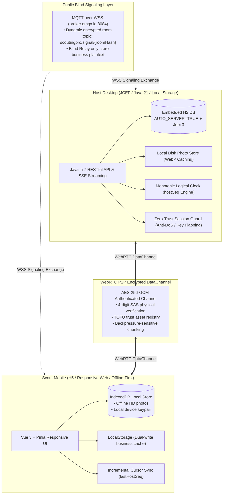
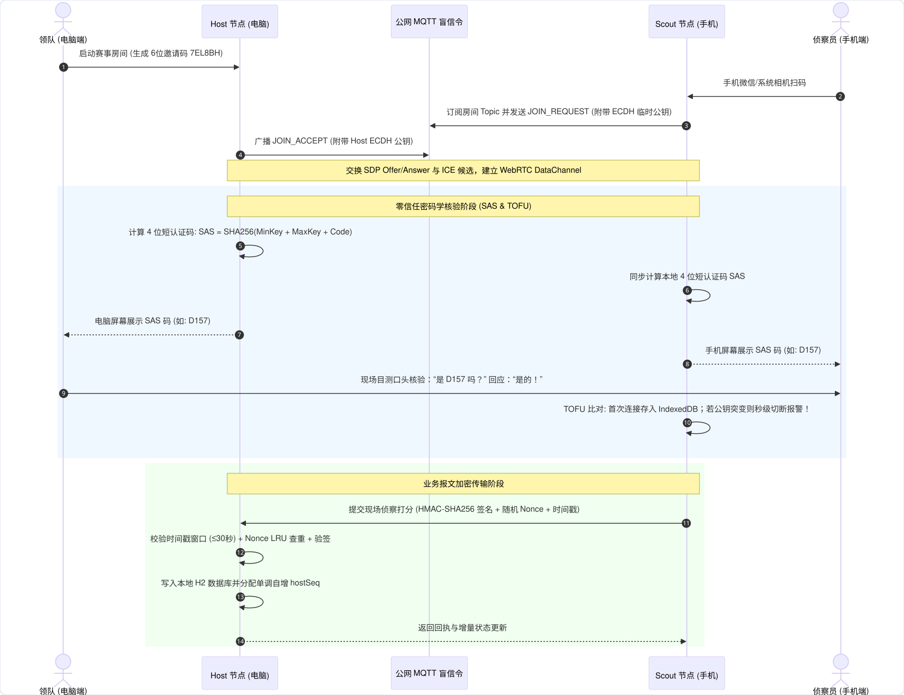
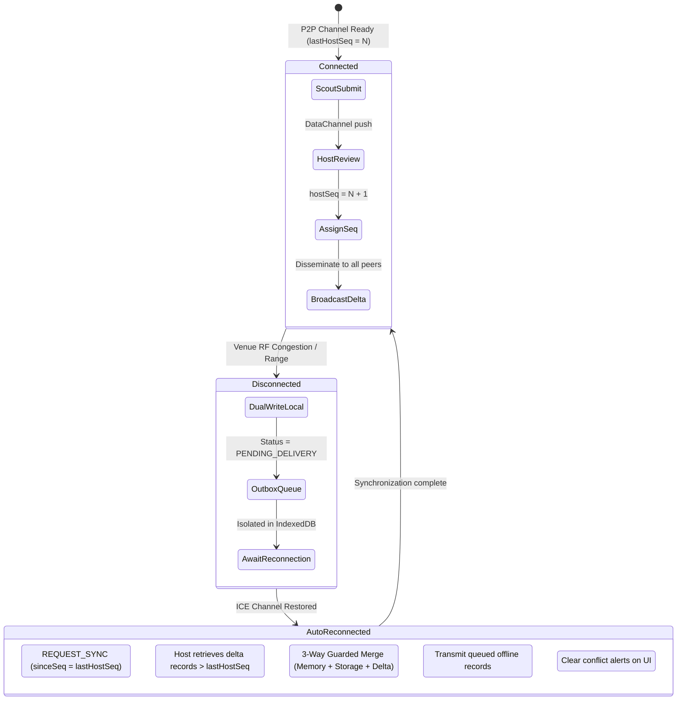
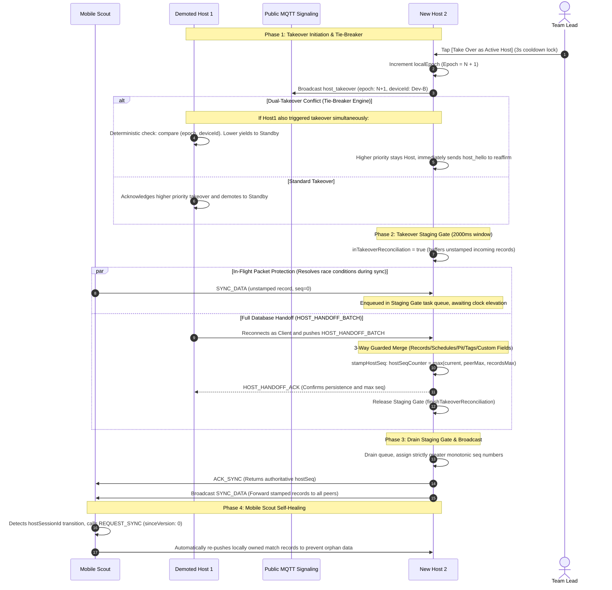
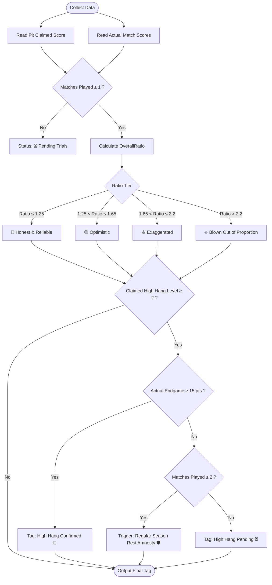

# ScoutingPro27 🚀

<p align="left">
  
  
  
  
  
  
  
  
</p>

<p align="left">
  <b>Language:</b>
  <a href="README.md"><b>简体中文</b></a> |
  <a href="README_en.md"><b>English</b></a>
</p>

> 💡 **This project was independently conceived, architected, and full-stack developed by middle and high school students of FIRST Tech Challenge (FTC) Team 27570 B.E.A.R.**  
> Born directly out of front-line competition demands, it redefines the scouting and match collaboration experience across global FIRST events through hardcore modern engineering practices.
> 
> 📌 **Release Positioning & Season Commitment (v1.0.1 MVP)**:  
> This release marks our **first stable, production-ready Minimum Viable Product (MVP)** for the new competition season.  
> **We officially commit: Prior to the very first official qualifying tournament, our team will deliver a major update** incorporating rule-driven refinements and front-line feedback to continuously advance our alliance analytics and collaboration capabilities!

---

## Table of Contents
- [1. Project Introduction](#1-project-introduction)
  - [1.1 Why Build ScoutingPro27?](#11-why-build-scoutingpro27)
  - [1.2 Groundbreaking Innovation: Public P2P Direct Mesh via WebRTC](#12-groundbreaking-innovation-public-p2p-direct-mesh-via-webrtc)
  - [1.3 Truly Decentralized: Zero Cloud Server, Zero Operational Cost](#13-truly-decentralized-zero-cloud-server-zero-operational-cost)
  - [1.4 Comprehensive Comparison of Open-Source FIRST Scouting Systems](#14-comprehensive-comparison-of-open-source-first-scouting-systems)
  - [1.5 Military-Grade User Data Security & Privacy Protection](#15-military-grade-user-data-security--privacy-protection)
  - [1.6 Full Bilingual Support & Native Glassmorphic Interface](#16-full-bilingual-support--native-glassmorphic-interface)
  - [1.7 Tech Stack Overview](#17-tech-stack-overview)
- [2. User Guide](#2-user-guide)
  - [2.1 Preparation & Quick Start (No Complex Setup)](#21-preparation--quick-start-no-complex-setup)
  - [2.2 Step 1: Lead Creates Event Room (Desktop)](#22-step-1-lead-creates-event-room-desktop)
  - [2.3 Step 2: Scouts Scan QR to Join (Mobile)](#23-step-2-scouts-scan-qr-to-join-mobile)
  - [2.4 Step 3: Pit Scouting — Hardware Specs & High-Res Photos](#24-step-3-pit-scouting--hardware-specs--high-res-photos)
  - [2.5 Step 4: Smart Scheduling — Station Assignment Matrix](#25-step-4-smart-scheduling--station-assignment-matrix)
  - [2.6 Step 5: Match Scouting — Unified Cycle Tracker & High-Speed Blind Scoring](#26-step-5-match-scouting--unified-cycle-tracker--high-speed-blind-scoring)
  - [2.7 Step 6: Power Ladder & "Brag Index" Quantified Reconciliation Model](#27-step-6-power-ladder--brag-index-quantified-reconciliation-model)
  - [2.8 Step 7: Official FTC Events API Integration & Penalty Deduction](#28-step-7-official-ftc-events-api-integration--penalty-deduction)
  - [2.9 Step 8: Dual-Host Standby Hot-Spare & Full-Sync Handoff Protocol](#29-step-8-dual-host-standby-hot-spare--full-sync-handoff-protocol)
  - [2.10 Step 9: Tactical AI Advisor](#210-step-9-tactical-ai-advisor)
  - [2.11 Step 10: Data Export & Flash Drive Offline Sync Package](#211-step-10-data-export--flash-drive-offline-sync-package)
  - [2.12 Step 11: Safe Single-Entry Event Deletion & Deep Offline Cache Flush](#212-step-11-safe-single-entry-event-deletion--deep-offline-cache-flush)
- [3. Technical Deep Dive](#3-technical-deep-dive)
  - [3.1 Public P2P Mesh & Blind Signaling Architecture](#31-public-p2p-mesh--blind-signaling-architecture)
  - [3.2 Zero-Trust Security & Mutual Authentication Flow](#32-zero-trust-security--mutual-authentication-flow)
  - [3.3 Distributed Monotonic Clock & Conflict Auto-Resolution](#33-distributed-monotonic-clock--conflict-auto-resolution)
  - [3.4 Host Takeover Full-Sync & Handoff Protocol](#34-host-takeover-full-sync--handoff-protocol)
  - [3.5 "Brag Index" Algorithm & Regular Season Rest Amnesty State Machine](#35-brag-index-algorithm--regular-season-rest-amnesty-state-machine)
- [4. Developer & Testing Guide](#4-developer--testing-guide)
  - [4.1 Local Development Prerequisites](#41-local-development-prerequisites)
  - [4.2 Fast Build & Run](#42-fast-build--run)
  - [4.3 Automated Verification & Test Suite](#43-automated-verification--test-suite)
- [License & Acknowledgements](#license--acknowledgements)

---

# 1. Project Introduction

### 1.1 Why Build ScoutingPro27?
In FIRST (FTC / FRC) Robotics Championships, **"Scouting" is the decisive strategic weapon for playoff alliance selection and match tactics**. However, real competition arenas present severe environmental obstacles:
1. **Network Blackouts are the Norm**: Thousands of spectators and participants crowd the venue. Wi-Fi channels are heavily congested or subject to strict radio interference control by organizers, and cellular signals choke up. Traditional web-based or cloud-dependent scouting apps freeze and spin endlessly.
2. **Traditional Tools are Inefficient**: Paper forms take immense labor to transcribe and cannot provide real-time aggregation. Manually scanning QR codes from scout phones one-by-one causes missed records and huge time lags. Self-hosting cloud servers incurs recurring annual expenses and complex DevOps.
3. **Data Conflicts & Exaggerated Claims**: Multiple scouts submit conflicting records; during pit visits, opposing teams often boast about unrealistic scoring capabilities or high-hang consistency without an objective cross-validation mechanism.

To fundamentally conquer these challenges, **the student engineering team of FTC Team 27570 independently developed ScoutingPro27**.

---

### 1.2 Groundbreaking Innovation: Public P2P Direct Mesh via WebRTC
ScoutingPro27 introduces an unprecedented breakthrough to the FIRST community by **bringing public WebRTC P2P direct peer-to-peer data channels and WSS blind signaling to competition collaboration**:
- **Bypassing Physical Network Boundaries**: The team lead's laptop can be connected to the venue Wi-Fi while scouts in the bleachers use 4G/5G cellular data — **no shared local network or router is required**!
- **True Sub-50ms Direct Communication**: Devices communicate directly through end-to-end encrypted WebRTC DataChannels. The moment a scout hits submit, records appear on the lead's screen within 50 milliseconds without passing through any intermediate proxy server.
- **Self-Healing Adaptive Pipeline**: Built-in dynamic watchdog monitors connection health. LAN Direct -> Public STUN Reflexive P2P -> Metered.ca TURN Relay gracefully transitions in real time, recovering within seconds under high interference.

---

### 1.3 Truly Decentralized: Zero Cloud Server, Zero Operational Cost
- **No Cloud Hosts Needed**: No need to purchase AliCloud, AWS, or Azure virtual machines; no domain registration; no Docker or public IP configuration.
- **Physical Data Sovereignty**: All team profiles, match scores, and high-resolution robot close-up photos are stored directly on the host machine's embedded H2 database and local file system. Even if the venue completely cuts off Internet access, the system operates at 100% capacity in standalone/LAN mode. Data is never exposed to third-party platforms.

---

### 1.4 Comprehensive Comparison of Open-Source FIRST Scouting Systems
The table below benchmarks **ScoutingPro27** against classic open-source scouting solutions across the FIRST community:

| Comparison Dimension | ScoutingPro27<br/>(This Project 🚀) | FRC 1678 Citrus Circuits<br/>(Legendary FRC System) | ScoutingPASS / PWNAGE<br/>(Classic Offline QR) | Cloud SaaS / TBA-Based<br/>(e.g., ScoutMaster) | Traditional Paper / Excel |
|:---|:---:|:---:|:---:|:---:|:---:|
| **Networking Architecture** | **Public WebRTC P2P Direct Mesh**<br/>(Decentralized) | Local Server + Bluetooth/Hotspot<br/>(Restricted Centralized) | Pure Offline Static QR<br/>(No Mesh Network) | Central Cloud Server<br/>(Centralized B/S) | No Network / Cloud Drive |
| **Server & Domain Cost** | **Zero Cost ($0 / yr)** | Requires Dedicated Master Laptop | **Zero Cost ($0 / yr)** | **High ($50–$300+ / yr)** | Cloud doc subscriptions |
| **Cross-Network Support** | **Direct link across Wi-Fi & 4G/5G** | Rigid LAN / Bluetooth pairing | None (Physical proximity needed) | Requires all nodes on public web | Manual walking runner |
| **Data Sync Latency** | **Sub-50ms bidirectional streaming** | Periodic batch polling | Single-record sequential QR scans | Cloud API polling delay | Post-match manual typing (hours) |
| **Mobile Access Convenience** | **System camera QR scan -> Web**<br/>(Zero app installation) | Requires dedicated Android APK | Static web QR generator | Web login with credentials | None |
| **Zero-Trust Security** | **ECDH + SAS 4-digit code + TOFU**<br/>(Defense-in-depth) | Plaintext / basic password | None (QR codes easily intercepted) | Standard HTTPS + Passwords | Plaintext |
| **Schedule & Match Dispatch** | **4-station matrix push to mobile** | Manual or static schedule | No live push | Some support (no screen lock) | Printed paper sheets |
| **Pit Scouting & HD Photos** | **Offline queue + WebP compression** | Basic text fields | Very limited text only | Cloud OSS object upload | Paper sketch / phone album mess |
| **Live Power Reconciliation** | **Proprietary "Brag Index" Model**<br/>(Claimed vs Actual multi-factor) | Manual trend graphs | Manual export to Tableau | Basic OPR / Average stats | Manual estimation |
| **High Hang Rest Amnesty** | **Built-in strategic rest detection** | None | None | None | None |
| **High-Availability Hot-Spare** | **Dual-Host Standby + Instant Handoff** | None (Single point of failure) | None | Dependent on cloud uptime | None |
| **Official API & Penalty Deduction** | **Event Code bind + Auto Penalty strip** | Partial support | None | Basic schedule fetch | Manual calculation |
| **Tactical AI Advisor** | **Built-in streaming AI with context feed** | None | None | Rare | None |
| **UI & Experience** | **Native Bilingual + Cyber Glassmorphism** | English only / Raw Android | English only / Basic forms | English mostly / Generic web | Handwritten paper |
| **Development Team** | **FTC Team 27570 Students** | Mentors + Senior Students | Mentors / Alumni | Commercial / Third-party | Ad-hoc team members |

---

### 1.5 Military-Grade User Data Security & Privacy Protection
Robot scouting holds sensitive tactical intelligence: alliance preferences, mechanical vulnerabilities, and defense notes. ScoutingPro27 constructs a **Zero-Trust Defense-in-Depth Architecture**:
1. **End-to-End Forward Secrecy**:
   - Uses **ECDH (P-256)** for ephemeral key exchange with **HKDF-SHA256** session key derivation, enforcing **AES-256-GCM** authenticated encryption across all channels. Eavesdroppers sniffing public Wi-Fi only capture unreadable high-entropy ciphertext.
2. **Visual Short Authentication String (SAS)**:
   - Defends against Man-in-the-Middle (MITM) attacks. Upon connection establishment, both screens calculate a matching **4-digit visual fingerprint (e.g., `D157`)** based on mutual public keys. Scouts and the lead verify this code face-to-face to cryptographically guarantee node authenticity.
3. **Trust-On-First-Use (TOFU) Device Identity**:
   - Device keys are safely retained upon first verification. Subsequent reconnections bypass prompts; **if a device's public key abruptly shifts during an active session (a classic session hijacking indicator), the system instantly trips a security fuse, terminating the link and raising a red security alert!**
4. **Anti-Tampering & Anti-Replay Defense**:
   - Every payload includes an **HMAC-SHA256 signature** keyed with the room secret, a ±30s sliding timestamp window, and a **5,000-capacity Nonce LRU deduplication cache** to defeat packet replay attacks.
5. **Local Secret Vault**:
   - API keys for AI tactical advisors are encrypted on disk via AES-256 and decrypted only in host memory during inference. **Keys are never broadcast over the network**.

---

### 1.6 Full Bilingual Support, Local High-Res Typography & Native Ergonomics
ScoutingPro27 delivers an uncompromised user experience crafted for global FIRST championships and cross-alliance multinational collaboration:
- **Seamless Internationalization (Full i18n Support)**:
  - Powered by `vue-i18n` with comprehensive English and Simplified Chinese dictionaries (1100+ keys with 100% strict 1:1 parity), supporting sub-millisecond hot-switching and persistent preferences.
  - Complete coverage spans Dashboard, QR onboarding, Pit scouting, match matrix, cycle counters, power ladders, dual-host takeover, and AI tactical chats.
- **Embedded Noto Sans SC High-Res Variable Font**:
  - Locally bundles Google Fonts `Noto Sans SC` Variable Font (weight range 100~900), completely packaged offline inside frontend static bundles and desktop installers;
  - Completely cures font blurring and edge artifacts for small Chinese characters, form badges, and buttons on high-DPI screens.
- **Unified Cyber Glassmorphic Design System**:
  - Eliminates jarring native browser `window.confirm` / `alert` popups (`localhost:8080 says`).
  - Powered by responsive custom glassmorphic modals (`ConfirmModal.vue` + `useConfirm.ts`) with Danger, Warning, and Info visual tiers, keyboard navigation, and mobile touch optimization.
- **Mobile Fast Transport HUD & Live Network Indicator**:
  - Micro Transport HUD pinned to mobile status bar displays real-time connection status with neon indicators (P2P Direct / TURN Relay / Offline);
  - Tap anytime to inspect network round-trip diagnostic metrics directly from the bleachers.
- **Host Permission Governance & Humanized Username Visibility**:
  - Strict role-based permissions: Host administrators maintain global authority to inspect, edit, or delete any scout's records; scouts retain full control over their own submissions;
  - History table and details completely hide internal database UUIDs, presenting human-readable scouter usernames.

---

### 1.7 Tech Stack Overview
- **Frontend & Client**: Vue 3 (Composition API), TypeScript, Pinia, Vue Router 4, TailwindCSS Animations, Web Crypto API, IndexedDB.
- **Transport & P2P Mesh**: WebRTC DataChannel, MQTT over WSS (Multi-broker failover cluster + Blind Signaling), STUN/TURN (Tencent Cloud / Xiaomi / Metered.ca ICE Infrastructure).
- **Desktop Host & Storage**: Java 21, Javalin 7 Lightweight Asynchronous Microservices, Embedded Relational H2 Database (`AUTO_SERVER=TRUE`), Jdbi 3, Flyway Database Migration, JCEF (Chromium Embedded Framework).

---

# 2. User Guide

### 2.1 Preparation & Quick Start (No Complex Setup)
- **Lead (Desktop)**: Download and extract the green release zip, then double-click the launcher. The embedded service and database start automatically, presenting the desktop interface.
- **Scouts (Mobile)**: **Zero download or app install required!** Any iPhone, Android phone, iPad, or tablet with a web browser (or WeChat) can join instantly.

---

### 2.2 Step 1: Lead Creates Event Room (Desktop)
1. Launch the desktop application and log in or register the lead name.
2. In the Dashboard, click **[Create Event]** and enter the official event title (e.g., `2026 World Championship Division`).
3. Once created, a unique **6-character room invite code (e.g., `7EL8BH`)** and a **dynamic onboarding QR code** are displayed on the screen.

---

### 2.3 Step 2: Scouts Scan QR to Join (Mobile)
1. Open the system camera or WeChat scanner on mobile and **scan the lead's desktop screen**.
2. The web client loads automatically. Enter your scout name (e.g., "Alex") and tap "Join Room".
3. **Verify Security Code**: Both devices display a matching 4-digit code (e.g., `D157`). Visually verify and confirm to complete zero-trust pairing.
4. **Independent of Network**: Even if the desktop is on venue Wi-Fi and the phone is on 4G/5G cellular data, the P2P connection establishes in milliseconds!

---

### 2.4 Step 3: Pit Scouting — Hardware Specs & High-Res Photos
Before matches begin, scouts visit team pits to evaluate mechanical capabilities:
1. Scouts tap **[Pit Scouting]** on the bottom navigation bar.
2. Enter the target team number (e.g., `#27570`) and inspect key hardware parameters:
   - **Drivetrain**: Mecanum, Tank (6WD/8WD), Swerve, Custom/Other;
   - **Mechanism**: Slide + Claw, Slide + Roller Intake, 1/2-DOF Pivot Arm, Linkage Arm, Hybrid;
   - **Launcher & Delivery**: Roller Drop, Catapult, Dual Flywheel, Turret;
   - **Ball Compatibility**: Universal, Smart Sorting, Pollen-only;
   - **Hang & Docking**: Winch, Cascade Slide, Linkage Lock, Passive Hooks;
   - **Odometry**: Motor Encoders, Dual-Wheel + IMU, Three-Wheel Omni, GoBILDA Pinpoint, SparkFun OTOS;
   - **Inspection Compliance**: 18" Sizing Cube check, Total Weight (≤42 lbs limit, auto-warning if overweight).
3. **High-Res Photos & Offline Queue**: Take photos of key mechanisms. Images are compressed to optimized WebP format and saved to the local IndexedDB outbox, progressively streaming to the host in the background.
4. Saved records synchronize to the lead's desktop instantaneously, where high-res photos can be viewed in detail.

---

### 2.5 Step 4: Smart Scheduling — Station Assignment Matrix
A standard match features 4 robots (Red 1, Red 2, Blue 1, Blue 2):
1. The lead opens **[Schedule Workbench]** on desktop and syncs matches from the official FTC API or pastes a CSV schedule.
2. Assign scout names across the 4 stations using batch drag-and-scroll or one-click clearing.
3. Upon saving, **assigned scouts' phones receive a prompt vibration and notification**.
4. **One-Tap Task Load**: On mobile, scouts tap [Load Task], and the match number, team number, and alliance color populate automatically — **preventing accidental errors under pressure!**

---

### 2.6 Step 5: Match Scouting — Unified Cycle Tracker & High-Speed Blind Scoring
1. Take a seat in the stands as the match begins! Open the **[Match Scouting]** form.
2. Supports **Single Team** and **Alliance Dual Team** modes, engineered for one-handed blind scoring:
   - **Autonomous Phase**:
     - **Leave**: One-tap toggle (+3 pts);
     - **Unified Cycle Tracker**: Tap **[+ Record New Cycle]** (starts at 0 balls). Tap the card to increment (0 -> 1 -> 2 -> 3 -> 4 cap) or directly tap 44px anti-misclick pills (0/1/2/3/4). Each scored ball earns +3 pts;
     - **Park**: One-tap loading zone park (+5 pts).
   - **TeleOp Phase**:
     - **Unified Cycle Tracker**: Decoupled from autonomous cycles to avoid number bleeding. Incremental tapping or direct pill selection (+2 pts per scored ball).
   - **Collapsible Waterfall View**:
     - Defaults to a compact 3-cycle view to save screen real estate;
     - **Smart Bottom Scroll**: Smoothly follows new cycles; historical review does not cause unexpected screen jumps. Expand all anytime.
   - **Endgame Phase**:
     - Rapidly record robot endgame park (5 pts / 10 pts) and Low / High Hang (15 pts / 30 pts).
   - **Failure Alert & Tactical Tags**:
     - Power failure or mechanical break? Tap the red **[Is Broken]** alarm button;
     - Tag behavioral traits (Fast Intake, Heavy Defense, Tippy/Jam-prone) and record text notes.
3. When the match ends, tap **[Submit Record]**, and data arrives at the host in 0.05s!
4. **Offline Resiliency**: In case of severe venue radio interference, records buffer safely in IndexedDB and flush automatically upon reconnection with zero data loss.

---

### 2.7 Step 6: Power Ladder & "Brag Index" Quantified Reconciliation Model
The desktop automatically ranks all teams on the Power Leaderboard using our proprietary **"Brag Index" algorithm**:
- **Calculation Formula**: Dynamically correlates pit-claimed theoretical scores with actual qualifications match baselines (averages and maximums):
  - 🎯 **[Honest & Reliable (≤ 1.25x)]**: Actual scores align closely with self-reported capabilities. Prime alliance target!
  - 🟡 **[Optimistic (1.25x ~ 1.65x)]**: Slightly inflated, but solid match consistency.
  - ⚠️ **[Exaggerated (1.65x ~ 2.20x)]**: Notable performance gap; assess with caution.
  - 🔥 **[Blown Out of Proportion (> 2.20x)]**: Scores less than half of claimed stats; red alert warning!
- **Regular Season Rest Amnesty 🛡️**:  
  If a premier team claimed high hang capabilities but did not hang in early qualifiers, is it false advertising? The algorithm intelligently identifies tactical mechanism preservation in early rounds and grants **[Regular Season Rest Amnesty 🛡️]**, protecting elite alliances from false penalties.

---

### 2.8 Step 7: Official FTC Events API Integration & Penalty Deduction
Connect directly to official FIRST data sources during sanctioned events:
1. **One-Click Event Code Binding**: Enter the official Event Code (e.g., `USCMPHO1`) and official API Token in event settings.
2. **Instant Schedule & Match Bracket Pull**: Pull qualifications/playoff matches, match order, and alliance pairings in seconds without manual CSV entry.
3. **Score Reconciliation & Penalty Deduction**:
   - Pull official match score breakdowns after referee confirmation;
   - **Strip Opponent Fouls**: Separates opponent foul points (Major/Minor) to isolate true offensive output against scouted tallies.

---

### 2.9 Step 8: Dual-Host Standby Hot-Spare & Full-Sync Handoff Protocol
Lead laptops face dead batteries, hardware crashes, or accidental cable disconnects. ScoutingPro27 features a **zero single-point-of-failure, split-brain-proof dual host architecture**:
1. **Standby Mirror & Debounce Protection**:
   - An assistant's secondary laptop joins in standby host mode, mirroring all DataChannel messages to maintain a synchronized local H2 snapshot;
   - The UI enforces an `isTakingOver` mutex with a **3-second countdown cooldown lock**, preventing accidental double-clicks and signaling floods.
2. **One-Tap Takeover & Deterministic Tie-Breaker**:
   - If the primary host goes down or shifts roles, the assistant clicks **[Take Over as Active Host]**;
   - **Anti-Split-Brain Deadlock**: If both hosts trigger takeover concurrently, the **Distributed Epoch Term + Device ID Tie-Breaker Engine** arbitrates deterministically: the higher priority node stays Host and reaffirms authority with `host_hello`, while the lower priority node demotes to Standby. Neither drops into an orphaned state.
3. **Full Handoff Batch (`HOST_HANDOFF_BATCH`)**:
   - The demoted host reconnects as a Client and dispatches all local match records, schedules, station assignments, pit data, tags, and custom fields to the new host;
   - The new host applies an idempotent **3-Way Guarded Merge (with photo key protection)**, advancing the global clock `hostSeqCounter` forward.
4. **Takeover Staging Gate (Solving In-Flight Packets during Handoff)**:
   - The new host activates a 2000ms asynchronous staging gate upon promotion. If a scout submits an unstamped match record during handoff, the record **pauses in a queue without receiving an outdated sequence number**;
   - Once the handoff batch arrives and advances the clock, the gate releases, stamping the queued record with a strictly higher monotonic sequence. If the former host is dead, the gate safely times out without blocking the flow.
5. **Mobile Scout Awareness & Orphan Self-Healing**:
   - Scout phones detect `hostSessionId` changes within 1–2 seconds, request a fresh baseline sync (`sinceVersion: 0`), and **re-push all locally owned records** (even if marked SYNCED) to heal any orphaned data.

---

### 2.10 Step 9: Tactical AI Advisor
1. Open the **[Tactical AI]** tab to inject full event rankings, pit specs, brag indices, and defensive ratings directly into LLMs (Google Gemini & OpenAI).
2. Ask tactical questions conversationally:
   - *"Our robot scores high in auto but lacks a reliable high hang. Which two teams should we pick for alliance selection?"*
   - *"Analyze weaknesses for team #18225. How should we play defense against them?"*
3. The AI streams tactical advice in markdown format. Any team number mentioned (e.g., `#27570`) is clickable to immediately open that team's profile card!

---

### 2.11 Step 10: Data Export & Flash Drive Offline Sync Package
- **Standard Reports**: Export all match records and pit metrics into structured **Excel / CSV sheets** for presentations and alliance review.
- **Extreme Venue Blackout: USB Flash Sync**:  
  Under total wireless communication bans:
  - The lead exports an **Event Configuration Package (`.event`)** and an **Incremental Update Package (`.info`)** to a flash drive;
  - Scouts insert the drive to join the event and import records offline. Scout submissions can also be collected via flash drive for host consolidation!

---

### 2.12 Step 11: Safe Single-Entry Event Deletion & Deep Offline Cache Flush
1. **Single-Entry Focus: Dashboard Card Safe Deletion**:
   - To eliminate accidental deletions during high-stakes scoring, **all delete buttons have been removed from the active event header and mobile HUD**;
   - Deletion is consolidated exclusively on the Dashboard event cards with a trash icon. Clicking prompts a cyber glassmorphic Danger confirmation modal with the event title before executing cascading deletion.
2. **Deep Local Cache Flush**:
   - A dedicated **[Clear Cache]** button sits in the Dashboard top bar;
   - Tapping it triggers a recursive scan that sweeps away stale event records, schedules, pit entries, and photo caches (matching `sp27_*`, `scoutingpro27_*`, `sp_inbox_*`), **while strictly preserving the scout's login credentials (`scoutingpro-user`)** so no re-login is needed.

---

# 3. Technical Deep Dive

### 3.1 Public P2P Mesh & Blind Signaling Architecture
ScoutingPro27 operates on an **offline-first decentralized architecture**. The host machine hosts local microservices, an embedded H2 database, and photo storage. Clients connect via WebRTC DataChannels. Public MQTT brokers simply relay blind connection handshakes (public keys, SDP, ICE candidates) without holding plaintext data.

<p align="center">
  
</p>

<details>
<summary><b>🔍 View Mermaid Architecture Source</b></summary>



</details>

---

### 3.2 Zero-Trust Security & Mutual Authentication Flow
During connection setup, both nodes execute cryptographic verification to thwart packet sniffing, MITM attacks, and unauthorized spoofing:

<p align="center">
  
</p>

<details>
<summary><b>🔍 View Mermaid Sequence Diagram Source</b></summary>

```mermaid
sequenceDiagram
    autonumber
    actor Lead as Lead (Desktop)
    participant Host as Host Node (Desktop)
    participant Signaling as Public MQTT Signaling
    participant Scout as Scout Node (Mobile)
    actor ScoutUser as Scout (Mobile)

    Lead->>Host: Start Event Room (Generate 6-char code 7EL8BH)
    ScoutUser->>Scout: Scan QR with camera
    Scout->>Signaling: Subscribe room topic & send JOIN_REQUEST (with ephemeral ECDH public key)
    Host->>Signaling: Broadcast JOIN_ACCEPT (with Host ECDH public key)
    Note over Host,Scout: Exchange SDP Offer/Answer & ICE candidates, open WebRTC DataChannel

    rect rgb(240, 248, 255)
    Note over Host,Scout: Zero-Trust Cryptographic Verification (SAS & TOFU)
    Host->>Host: Compute 4-digit code: SAS = SHA256(MinKey + MaxKey + Code)
    Scout->>Scout: Compute local 4-digit SAS code
    Host-->>Lead: Display SAS code on desktop (e.g., D157)
    Scout-->>ScoutUser: Display SAS code on mobile (e.g., D157)
    Lead->>ScoutUser: Verbal check: "Is it D157?" Scout responds: "Yes!"
    Scout->>Scout: TOFU check: First connection stored in IndexedDB; alert if key flapped!
    end

    rect rgb(240, 255, 240)
    Note over Host,Scout: Encrypted Business Data Transmission
    Scout->>Host: Submit match record (HMAC-SHA256 signature + Nonce + Timestamp)
    Host->>Host: Validate timestamp window (≤30s) + Nonce LRU check + verify sig
    Host->>Host: Persist to H2 DB and assign monotonic hostSeq
    Host-->>Scout: Return ACK with updated state
    end
```

</details>

---

### 3.3 Distributed Monotonic Clock & Conflict Auto-Resolution
Local clocks frequently skew across phones. ScoutingPro27 discards fragile wall-clock timestamps in favor of a **host-assigned monotonically increasing logical clock `hostSeq`**:

<p align="center">
  
</p>

<details>
<summary><b>🔍 View Mermaid State Machine Source</b></summary>



</details>

---

### 3.4 Host Takeover Full-Sync & Handoff Protocol
In decentralized or weak networks, multiple hosts attempting to take over can cause **dual-demotion deadlocks (split-brain)**, **clock regressions overwriting data**, or **lost in-flight packets**.

ScoutingPro27 solves this with a **zero-bug, concurrency-safe, self-healing** full handoff protocol guarded by five technical shields:

<details>
<summary><b>🔍 View Mermaid Takeover & Handoff Sequence Source</b></summary>



</details>

#### Key Defensive Concurrency Mechanisms:
1. **Distributed Epoch Term + Device ID Deterministic Tie-Breaker**:
   - Eliminates the classic split-brain condition where both nodes demote each other simultaneously, leaving the room without an active host.
2. **Absolute Monotonic Clock Advancement (`stampHostSeq`)**:
   - Preserves existing positive sequence numbers on historical records while advancing the local counter; only new records receive newly incremented sequence numbers.
3. **Takeover Staging Gate**:
   - Enforces a 2000ms staging gate on takeover. Fresh unstamped match records from mobile scouts pause in an asynchronous microtask queue until the predecessor's handoff batch elevates the clock, preventing duplicate or lower sequence numbers.
4. **SDP Serialization & Error Isolation (`activeSetupPromise`)**:
   - Serializes overlapping client connection requests with exception isolation in `try-catch`, eliminating WebRTC state errors (`Called in wrong state: have-local-offer`).
5. **Loopback Binding for Embedded H2 (`h2.bindAddress=127.0.0.1`)**:
   - Enforces `127.0.0.1` binding on startup for H2's `AUTO_SERVER`, immune to TUN virtual interfaces created by VPN or proxy clients.

---

### 3.5 "Brag Index" Algorithm & Regular Season Rest Amnesty State Machine
The system cross-references pit claims against actual competition performance:

$$
\text{OverallRatio} = \frac{\text{ClaimedTotalScore}}{\max(\text{MaxActualScore}, \text{AvgActualScore} \times 1.05, 1)}
$$

> 📌 **Benchmark Formula**:  
> `OverallRatio = ClaimedTotalScore / max(MaxActualScore, AvgActualScore × 1.05, 1)`

<p align="center">
  
</p>

<details>
<summary><b>🔍 View Mermaid Decision Flow Source</b></summary>



</details>

---

# 4. Developer & Testing Guide

### 4.1 Local Development Prerequisites
- **Backend**: JDK 21+, Maven 3.8+
- **Frontend**: Node.js 18+ (20 or 22 recommended), npm 9+
- **Network**: Internet access to public standard WSS / MQTT ports for signaling tests.

### 4.2 Fast Build & Run
```powershell
# 1. Compile frontend static assets (including PWA Service Worker & type checking)
cd frontend
npm install
npm run build

# 2. Run backend (Headless microservice mode)
cd ../Backend
mvn compile exec:java -Dexec.mainClass="com.bear27570.app.Main" -Dexec.args="--headless --port=8080"

# 3. Production executable Fat Jar packaging
mvn package -DskipTests
# The packaged artifact is located at target/ScoutingPro27.jar; run directly with java -jar ScoutingPro27.jar
```
Navigate to `http://localhost:8080` in your browser.

### 4.3 Automated Verification & Test Suite
ScoutingPro27 enforces an **Evidence Triad verification policy** with comprehensive regression coverage:

```powershell
# 1. Frontend TypeScript static analysis (vue-tsc --build 0 error)
cd frontend
npm run type-check

# 2. Frontend Vitest unit & component test suite (73 test suites / 562 tests 100% passing)
npm test -- --run

# 3. Backend Maven Surefire test suite (136 tests 100% passing)
cd ../Backend
mvn test

# 4. Full-link End-to-End browser concurrency simulation
cd ../frontend
node e2e/inbox-lifecycle.e2e.js     # Test 1: Inbox global lifecycle
node e2e/motion-and-sheet.e2e.js     # Test 2: Motion specs & sheet teardown (24 tests pass)
node e2e/qr-mobile-join.e2e.js       # Test 3: Mobile QR onboarding & viewport adaptation (15 tests pass)
node e2e/multi-client.test.js        # Test 4: WebRTC Relay / offline queues / HMAC security (11 phases pass)
```

---

## License & Acknowledgements

- **License**: Released under the open-source [MIT License](LICENSE).
- **Special Thanks**:
  - To **FIRST** for creating an inspiring global robotics stage;
  - To the open-source communities powering our stack (Vue.js, Javalin, WebRTC, EMQX, Metered.ca);
  - To every scout, mentor, and team member of **FTC Team 27570 B.E.A.R.** who contributed testing, match logging, and invaluable suggestions!

---

<p align="center">
  <b>Designed & Built with ❤️ by FTC Team 27570 B.E.A.R.</b><br/>
  <i>Empowering Every Robot Alliance with Next-Gen Distributed Intelligence.</i>
</p>
